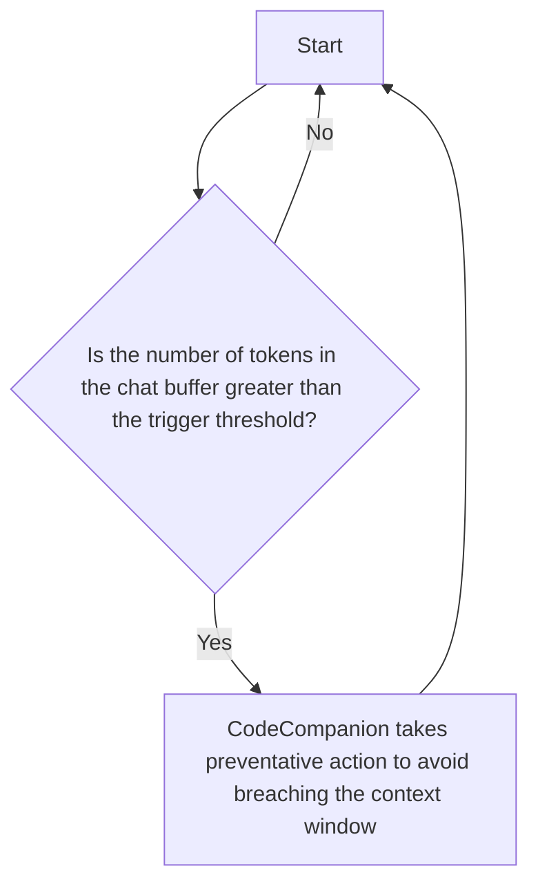

# Architecture

This section of the documentation covers architectural concepts and design principles that underpin CodeCompanion's functionality.

This is not mandatory reading for users of CodeCompanion. It may be of interest to those who are looking to understand some of the technical details of how CodeCompanion works, or those who are looking to contribute to the project.

## How Context Is Managed

One of the limitations of working with LLMs is that of context, as they have a finite window with which they can respond to a user's ask. That is, there's only a certain amount of data that LLMs can reference in order to generate a response. To equate this to human terms, it can be thought of as [working memory](https://en.wikipedia.org/wiki/Working_memory) and it varies greatly depending on what model you're using. The context window is measured in [tokens](https://platform.claude.com/docs/en/about-claude/glossary#tokens).

When a user breaches the context window, the conversation **ends** and it **cannot** continue. This can be hugely inconvenient in the middle of a coding session and potentially time consuming to recover from. CodeCompanion has context awareness which means it can prevent this from happening by taking **preventative** action.

### In the Chat Buffer

> [!NOTE]
> CodeCompanion enables context management by default

Firstly, CodeCompanion manages context by paying close attention to the number of tokens in the [chat buffer](/usage/chat-buffer/index), matching them against a defined trigger threshold in your config, which can be [customised](/configuration/chat-buffer#context-management).

When triggered, CodeCompanion follows the process outlined below:

