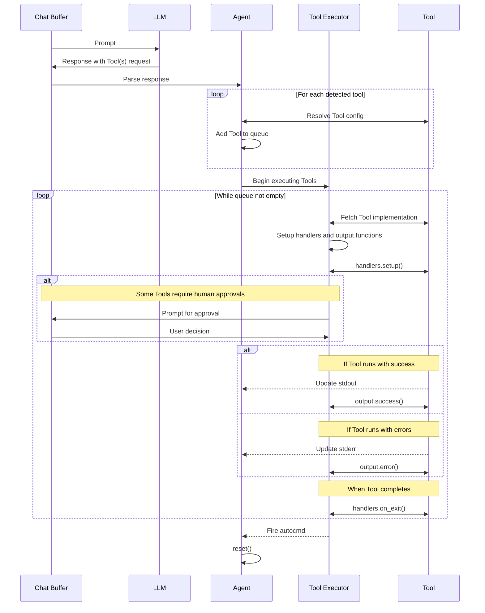

# Creating Tools

In CodeCompanion, tools offer pre-defined ways for LLMs to execute actions on your machine, acting as an Agent in the process. This guide walks you through the implementation of tools, enabling you to create your own.

In the plugin, tools work by sharing a system prompt with an LLM. This instructs the LLM how to produce an XML markdown code block which can, in turn, be interpreted by the plugin to execute a command or function.

## Architecture

In order to create tools, you do not need to understand the underlying architecture. However, for those who are curious about the implementation, please see the diagram below:



## Building Your First Tool

Before we begin, it's important to familiarise yourself with the directory structure of the agents and tools implementation:

```
strategies/chat/agents
├── init.lua
├── executor/
│   ├── cmd.lua
│   ├── func.lua
│   ├── init.lua
│   ├── queue.lua
├── tools/
│   ├── cmd_runner.lua
│   ├── editor.lua
│   ├── files.lua
│   ├── rag.lua
```

When a tool is detected, the chat buffer sends any output to the `agents/init.lua` file (I will commonly refer to that as the _"agent file"_ throughout this document). The agent file then parses the output into XML, identifying the tool and duly executing it.

There are two types of tools that CodeCompanion can leverage:

1. **Command-based**: These tools can execute a series of commands in the background using a [plenary.job](https://github.com/nvim-lua/plenary.nvim/blob/master/lua/plenary/job.lua). They're non-blocking, meaning you can carry out other activities in Neovim whilst they run. Useful for heavy/time-consuming tasks.
2. **Function-based**: These tools, like [@editor](https://github.com/olimorris/codecompanion.nvim/blob/main/lua/codecompanion/strategies/chat/tools/editor.lua), execute Lua functions directly in Neovim within the main process, one after another.

For the purposes of this section of the guide, we'll be building a simple function-based calculator tool that an LLM can use to do basic maths.

### Tool Structure

All tools must implement the following structure which the bulk of this guide will focus on explaining:

```lua
---@class CodeCompanion.Agent.Tool
---@field name string The name of the tool
---@field cmds table The commands to execute
---@field schema table The schema that the LLM must use in its response to execute a tool
---@field system_prompt fun(schema: table, xml2lua: table): string The system prompt to the LLM explaining the tool and the schema
---@field opts? table The options for the tool
---@field env? fun(schema: table): table|nil Any environment variables that can be used in the *_cmd fields. Receives the parsed schema from the LLM
---@field handlers table Functions which handle the execution of a tool
---@field handlers.setup? fun(agent: CodeCompanion.Agent): any Function used to setup the tool. Called before any commands
---@field handlers.on_exit? fun(agent: CodeCompanion.Agent): any Function to call at the end of a group of commands or functions
---@field output? table Functions which handle the output after every execution of a tool
---@field output.prompt fun(agent: CodeCompanion.Agent, self: CodeCompanion.Agent.Tool): string The message which is shared with the user when asking for their approval
---@field output.rejected? fun(agent: CodeCompanion.Agent, cmd: table): any Function to call if the user rejects running a command
---@field output.error? fun(agent: CodeCompanion.Agent, cmd: table, stderr: table, stdout?: table): any The function to call if an error occurs
---@field output.success? fun(agent: CodeCompanion.Agent, cmd: table, stdout: table): any Function to call if the tool is successful
---@field request table The request from the LLM to use the Tool
```

### `cmds`

**Command-Based Tools**

The `cmds` table is a collection of commands which the agent will execute one after another, asynchronously, using [plenary.job](https://github.com/nvim-lua/plenary.nvim/blob/master/lua/plenary/job.lua).

```lua
cmds = {
  { "make", "test" },
  { "echo", "hello" },
}
```

In this example, the plugin will execute `make test` followed by `echo hello`. After each command executes, the plugin will automatically send the output to a corresponding table on the agent file. If the command ran with success the output will be written to `stdout`, otherwise it will go to `stderr`. We'll be covering how you access that data in the output section below.

> [!IMPORTANT]
> Using the `handlers.setup()` function, it's also possible to create commands dynamically like in the [@cmd_runner](/usage/chat-buffer/agents.html#cmd-runner) tool.

**Function-based Tools**

Function-based tools use the `cmds` table to define functions that will be executed one after another. Each function has three parameters, itself, the actions request by the LLM and any input from a previous function call. For the purpose of our calculator example:

```lua
cmds = {
  ---@param self CodeCompanion.Agent.Tool The Tools object
  ---@param actions table The action object
  ---@param input? any The output from the previous function call
  ---@return nil|{ status: string, msg: string }
  function(self, actions, input)
    -- Get the numbers and operation requested by the LLM
    local num1 = tonumber(actions.num1)
    local num2 = tonumber(actions.num2)
    local operation = actions.operation

    -- Validate input
    if not num1 then
      return { status = "error", data = "First number is missing or invalid" }
    end

    if not num2 then
      return { status = "error", data = "Second number is missing or invalid" }
    end

    if not operation then
      return { status = "error", data = "Operation is missing" }
    end

    -- Perform the calculation
    local result
    if operation == "add" then
      result = num1 + num2
    elseif operation == "subtract" then
      result = num1 - num2
    elseif operation == "multiply" then
      result = num1 * num2
    elseif operation == "divide" then
      if num2 == 0 then
        return { status = "error", data = "Cannot divide by zero" }
      end
      result = num1 / num2
    else
      return { status = "error", data = "Invalid operation: must be add, subtract, multiply, or divide" }
    end

    return { status = "success", data = result }
  end,
},
```

Similarly with command-based tools, the output is written to the `stdout` or `stderr` tables on the agent file. However, with function-based tools, the user must manually specify the outcome of the execution which in turn redirects the output to the correct table:

```lua
return { status = "error", data = "Invalid operation: must be add, subtract, multiply, or divide" }
```

Will cause execution of the tool to stop and populate `stderr` on the agent file.

```lua
return { status = "success", data = result }
```

Will populate the `stdout` table on the agent file and allow for execution to continue.

### `schema`

The XML that the LLM has sent, is parsed and sent to the `actions` parameter of any function you've created in [cmds](/extending/tools.html#cmds), as a Lua table. If the LLM has done its job correctly, the Lua table should be the representation of what you've described in the schema.

In summary, the schema represents the structure of the response that the LLM must follow in order to call the tool. The schema is structured in Lua before being converted into XML with the awesome [xml2lua](https://github.com/manoelcampos/xml2lua) parser.

For our basic calculator tool, which does an operation on two numbers, the schema could look something like:

```lua
schema = {
  _attr = { name = "calculator" },
  action = {
    num1 = "100",
    num2 = "50",
    operation = "multiply"
  },
},
```

### `system_prompt`

In the plugin, LLMs are given knowledge about a tool and its schema via a system prompt. This method also informs the LLM on how to use the tool to achieve a desired outcome.

For our calculator tool, our `system_prompt` could look something like:

````lua
---@param schema table
---@param xml2lua table
---@return string
system_prompt = function(schema, xml2lua)
  return string.format([[## Calculator Tool (`calculator`)

### Purpose:
- To do a mathematical operation on two numbers.

### When to Use:
- Only invoke the calculator tool when the user specifically asks you

### Execution Format:
- Always return an XML markdown code block

### XML Schema:
Each tool invocation should adhere to this structure:

```xml
%s
```

where:
- `num1` is the first number to do any calculations with
- `num2` is the second number to do any calculations with
- `operation` is the mathematical operation to do on the two numbers. It MUST be one of `add`, `subtract`, `multiply` or `divide`

### Reminder:
- Minimize extra explanations and focus on returning correct XML blocks.
- Always use the structure above for consistency.]],
    xml2lua.toXml(schema, "tool")
  )
end,
````

You'll notice that the `system_prompt` function has two parameters:

- The [schema](/extending/tools.html#schema) table that we created earlier
- The [xml2lua](https://github.com/manoelcampos/xml2lua) library that comes with the plugin

Whilst the latter is not mandated for use in the system prompt, it's the most optimum way of converting your schema to XML. You can see in the example above how we're using it. As a result, the system prompt that will be sent to the LLM will be:

````
## Calculator Tool (`calculator`) - Enhanced Guidelines

### Purpose:
- To do a mathematical operation on two numbers.

### When to Use:
- Only invoke the calculator tool when the user specifically asks you

### Execution Format:
- Always return an XML markdown code block

### XML Schema:
Each tool invocation should adhere to this structure:

```xml
<tool name="calculator">
  <action>
    <num1>100</num1>
    <num2>50</num2>
    <operation>multiply</operation>
  </action>
</tool>
```

where:
- `num1` is the first number to do any calculations with
- `num2` is the second number to do any calculations with
- `operation` is the mathematical operation to do on the two numbers. It MUST be one of `add`, `subtract`, `multiply` or `divide`

### Reminder:
- Minimize extra explanations and focus on returning correct XML blocks.
- Always use the structure above for consistency.
````

### `handlers`

The _handlers_ table contains two functions that are executed before and after a tool completes:

1. `setup` - Is called **before** anything in the [cmds](/extending/tools.html#cmds) and [output](/extending/tools.html#output) table. This is useful if you wish to set the cmds dynamically on the tool itself, like in the [@cmd_runner](https://github.com/olimorris/codecompanion.nvim/blob/main/lua/codecompanion/strategies/chat/agents/tools/cmd_runner.lua) tool.
2. `on_exit` - Is called **after** everything in the [cmds](/extending/tools.html#cmds) and [output](/extending/tools.html#output) table.

For the purposes of our calculator, let's just return some notifications so you can see the agent and tool flow:

```lua
handlers = {
  setup = function(agent)
    return vim.notify("setup function called", vim.log.levels.INFO)
  end,
  on_exit = function(agent)
    return vim.notify("on_exit function called", vim.log.levels.INFO)
  end,
},
```

### `output`

The _output_ table enables you to manage and format output from the execution of the [cmds](/extending/tools.html#cmds). It contains four functions:

1. `success` - Is called after _every_ successful execution of a command/function. This can be a useful way of notifying the LLM of the success.
2. `error` - Is called when an error occurs whilst executing a command/function. It will only ever be called once as the whole execution of the [cmds](/extending/tools.html#cmds) is halted. This can be a useful way of notifying the LLM of the failure.
3. `prompt` - Is called when user approval to execute the [cmds](/extending/tools.html#cmds) is required. It forms the message prompt which the user is asked to confirm or reject.
4. `rejected` - Is called when a user rejects the approval to run the [cmds](/extending/tools.html#cmds). This method is used to inform the LLM of the rejection.

Let's consider how me might implement this for our calculator tool:

```lua
output = {
  ---@param agent CodeCompanion.Agent
  ---@param cmd table The command that was executed
  ---@param stdout table
  success = function(agent, cmd, stdout)
    local config = require("codecompanion.config")
    return agent.chat:add_buf_message({
      role = config.constants.USER_ROLE,
      content = string.format("The output from the calculator was %d", tonumber(stdout[1]))
    })
  end,
  error = function(agent)
    return vim.notify("An error occurred", vim.log.levels.ERROR)
  end,
},
```

### Running the Calculator tool

If we put this all together in our config:

````lua
require("codecompanion").setup({
  strategies = {
    chat = {
      tools = {
        calculator = {
          description = "Perform calculations",
          callback = {
            name = "calculator",
            cmds = {
              function(self, actions, input)
                -- Get the numbers and operation requested by the LLM
                local num1 = tonumber(actions.num1)
                local num2 = tonumber(actions.num2)
                local operation = actions.operation

                -- Validate input
                if not num1 then
                  return { status = "error", data = "First number is missing or invalid" }
                end

                if not num2 then
                  return { status = "error", data = "Second number is missing or invalid" }
                end

                if not operation then
                  return { status = "error", data = "Operation is missing" }
                end

                -- Perform the calculation
                local result
                if operation == "add" then
                  result = num1 + num2
                elseif operation == "subtract" then
                  result = num1 - num2
                elseif operation == "multiply" then
                  result = num1 * num2
                elseif operation == "divide" then
                  if num2 == 0 then
                    return { status = "error", data = "Cannot divide by zero" }
                  end
                  result = num1 / num2
                else
                  return {
                    status = "error",
                    data = "Invalid operation: must be add, subtract, multiply, or divide",
                  }
                end

                return { status = "success", data = result }
              end,
            },
            schema = {
              _attr = { name = "calculator" },
              action = {
                num1 = "100",
                num2 = "50",
                operation = "multiply",
              },
            },
            system_prompt = function(schema, xml2lua)
              return string.format(
                [[## Calculator Tool (`calculator`) - Enhanced Guidelines

### Purpose:
- To do a mathematical operation on two numbers.

### When to Use:
- Only invoke the calculator tool when the user specifically asks you

### Execution Format:
- Always return an XML markdown code block

### XML Schema:
Each tool invocation should adhere to this structure:

```xml
%s
```

where:
- `num1` is the first number to do any calculations on
- `num2` is the second number to do any calculations on
- `operation` is the mathematical operation to do on the two numbers. It MUST be one of `add`, `subtract`, `multiply` or `divide`

### Reminder:
- Minimize extra explanations and focus on returning correct XML blocks.
- Always use the structure above for consistency.]],
                xml2lua.toXml(schema, "tool")
              )
            end,
            handlers = {
              setup = function(agent)
                return vim.notify("setup function called", vim.log.levels.INFO)
              end,
              on_exit = function(agent)
                return vim.notify("on_exit function called", vim.log.levels.INFO)
              end,
            },
            output = {
              ---@param agent CodeCompanion.Agent
              ---@param cmd table The command that was executed
              ---@param stdout table
              success = function(agent, cmd, stdout)
                local config = require("codecompanion.config")
                return agent.chat:add_buf_message({
                  role = config.constants.USER_ROLE,
                  content = string.format("The output from the calculator was %d", tonumber(stdout[1])),
                })
              end,
              error = function(agent)
                return vim.notify("An error occurred", vim.log.levels.ERROR)
              end,
            },
          },
        },
      },
    }
  }
})
````

and with the prompt?

```
@calculator what is 100*50?
```

You should see `The output from the calculator was 5000` in the chat buffer.

### Adding in User Approvals

A big concern for users when they create and deploy their own tools is _"what if an LLM does something I'm not aware of or I don't approve?"_. To that end, CodeCompanion tries to make it easy for a user to be the "human in the loop" and approve tool use before execution.

To enable this for any tool, simply add the `requires_approval = true` in a tool's `opts` table:

```lua
require("codecompanion").setup({
  strategies = {
    chat = {
      tools = {
        calculator = {
          description = "Perform calculations",
          callback = "as above",
          opts = {
            requires_approval = true,
          },
        }
      }
    }
  }
})
```

To account for the user being prompted for an approval, we can add a `output.prompt` to the tool:

```lua
output = {
  -- success and error functions remain the same ...

  ---The message which is shared with the user when asking for their approval
  ---@param agent CodeCompanion.Agent
  ---@param self CodeCompanion.Agent.Tool
  ---@return string
  prompt = function(agent, self)
    return "Calculate " .. self.request.action.num1 .. " " .. self.request.action.operation .. " " .. self.request.action.num2 .. "?"
  end,
},
```

You can also customize the output if a user does not approve the request:

```lua
output = {
  -- success, error and prompt functions remain the same ...

    ---Rejection message back to the LLM
    ---@param agent CodeCompanion.Agent
    ---@param cmd table
    ---@return nil
    rejected = function(agent, cmd)
      local config = require("codecompanion.config")
      return agent.chat:add_buf_message({
        role = config.constants.USER_ROLE,
        content = "The user rejected your request to run the calculator tool"
      })
  end,
},
```

### `request`

At runtime, CodeCompanion will take the LLMs XML request and add that to a `request` table on the tool itself to make it easy to access.
