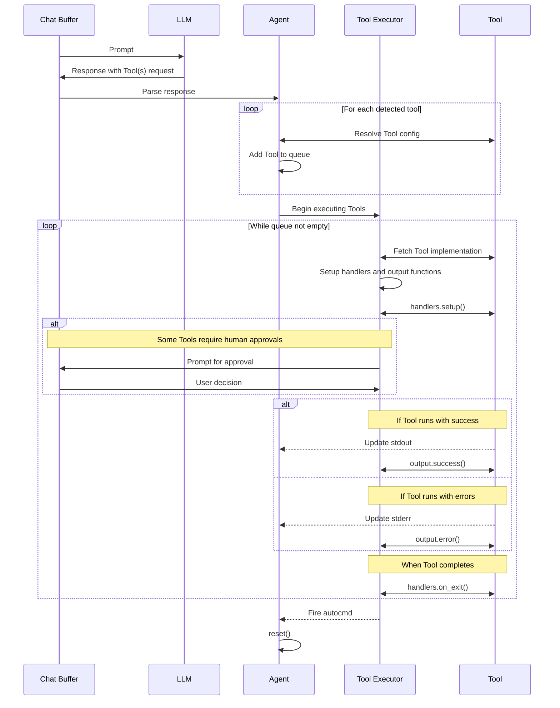

# Creating Tools

In CodeCompanion, tools offer pre-defined ways for LLMs to call functions on your machine, acting as an Agent in the process. This guide walks you through the implementation of tools, enabling you to create your own.

In the plugin, tools are a Lua table, consisting of various handler and output functions, alongside a system prompt and an [OpenAI compatible schema](https://platform.openai.com/docs/guides/function-calling?api-mode=chat).

When you add a tool to the chat buffer, this gives the LLM the knowledge to be able to call the tool, when required. Once called, the plugin will parse the LLM's response and execute the tool accordingly, before sharing the output in the chat buffer.

## Architecture

In order to create tools, you do not need to understand the underlying architecture. However, for those who are curious about the implementation, please see the diagram below:



## Building Your First Tool

Before we begin, it's important to familiarise yourself with the directory structure of the agents and tools implementation:

```
strategies/chat/agents
├── init.lua
├── executor/
│   ├── cmd.lua
│   ├── func.lua
│   ├── init.lua
│   ├── queue.lua
├── tools/
│   ├── cmd_runner.lua
│   ├── editor.lua
│   ├── files.lua
```

When a tool is detected, the chat buffer sends any output to the `agents/init.lua` file (I will commonly refer to that as the _"agent file"_ throughout this document). The agent file then parses the response from the LLM, identifying the tool and duly executing it.

There are two types of tools that CodeCompanion can leverage:

1. **Command-based**: These tools can execute a series of commands in the background using a [plenary.job](https://github.com/nvim-lua/plenary.nvim/blob/master/lua/plenary/job.lua). They're non-blocking, meaning you can carry out other activities in Neovim whilst they run. Useful for heavy/time-consuming tasks.
2. **Function-based**: These tools, like [insert_edit_into_file](https://github.com/olimorris/codecompanion.nvim/blob/main/lua/codecompanion/strategies/chat/agents/tools/insert_edit_into_file.lua), execute Lua functions directly in Neovim within the main process, one after another.

For the purposes of this section of the guide, we'll be building a simple function-based calculator tool that an LLM can use to do basic maths.

### Tool Structure

All tools must implement the following structure which the bulk of this guide will focus on explaining:

```lua
---@class CodeCompanion.Agent.Tool
---@field name string The name of the tool
---@field args table The arguments sent over by the LLM when making the function call
---@field cmds table The commands to execute
---@field function_call table The function call from the LLM
---@field schema table The schema that the LLM must use in its response to execute a tool
---@field system_prompt string | fun(schema: table): string The system prompt to the LLM explaining the tool and the schema
---@field opts? table The options for the tool
---@field env? fun(schema: table): table|nil Any environment variables that can be used in the *_cmd fields. Receives the parsed schema from the LLM
---@field handlers table Functions which handle the execution of a tool
---@field handlers.setup? fun(self: CodeCompanion.Agent.Tool, agent: CodeCompanion.Agent): any Function used to setup the tool. Called before any commands
---@field handlers.on_exit? fun(self: CodeCompanion.Agent.Tool, agent: CodeCompanion.Agent): any Function to call at the end of a group of commands or functions
---@field output? table Functions which handle the output after every execution of a tool
---@field output.prompt fun(self: CodeCompanion.Agent.Tool, agent: CodeCompanion.Agent): string The message which is shared with the user when asking for their approval
---@field output.rejected? fun(self: CodeCompanion.Agent.Tool, agent: CodeCompanion.Agent, cmd: table): any Function to call if the user rejects running a command
---@field output.error? fun(self: CodeCompanion.Agent.Tool, agent: CodeCompanion.Agent, cmd: table, stderr: table, stdout?: table): any The function to call if an error occurs
---@field output.success? fun(self: CodeCompanion.Agent.Tool, agent: CodeCompanion.Agent, cmd: table, stdout: table): any Function to call if the tool is successful
```

### `cmds`

**Command-Based Tools**

The `cmds` table is a collection of commands which the agent will execute one after another, asynchronously, using [plenary.job](https://github.com/nvim-lua/plenary.nvim/blob/master/lua/plenary/job.lua).

```lua
cmds = {
  { "make", "test" },
  { "echo", "hello" },
}
```

In this example, the plugin will execute `make test` followed by `echo hello`. After each command executes, the plugin will automatically send the output to a corresponding table on the agent file. If the command ran with success the output will be written to `stdout`, otherwise it will go to `stderr`. We'll be covering how you access that data in the output section below.

It's also possible to pass in environment variables (from the `env` function) by use of ${} brackets. The now removed _@code_runner_ tool used them as below:

```lua
cmds = {
    { "docker", "pull", "${lang}" },
    {
      "docker",
      "run",
      "--rm",
      "-v",
      "${temp_dir}:${temp_dir}",
      "${lang}",
      "${lang}",
      "${temp_input}",
    },
  },
},
---@param self CodeCompanion.Agent.Tool
---@return table
env = function(self)
  local temp_input = vim.fn.tempname()
  local temp_dir = temp_input:match("(.*/)")
  local lang = self.args.lang
  local code = self.args.code

  return {
    code = code,
    lang = lang,
    temp_dir = temp_dir,
    temp_input = temp_input,
  }
end,
```

> [!IMPORTANT]
> Using the `handlers.setup()` function, it's also possible to create commands dynamically like in the [cmd_runner](https://github.com/olimorris/codecompanion.nvim/blob/main/lua/codecompanion/strategies/chat/agents/tools/cmd_runner.lua) tool.

**Function-based Tools**

Function-based tools use the `cmds` table to define functions that will be executed one after another. Each function has four parameters, itself, the actions request by the LLM, any input from a previous function call and a `output_handler` callback for async execution.
The `output_handler` handles the result for an asynchronous tool. For a synchronous tool (like the calculator) you can ignore it.
For the purpose of our calculator example:

```lua
cmds = {
  ---@param self CodeCompanion.Tool.Calculator The Calculator tool
  ---@param args table The arguments from the LLM's tool call
  ---@param input? any The output from the previous function call
  ---@return nil|{ status: "success"|"error", data: string }
  function(self, args, input)
    -- Get the numbers and operation requested by the LLM
    local num1 = tonumber(args.num1)
    local num2 = tonumber(args.num2)
    local operation = args.operation

    -- Validate input
    if not num1 then
      return { status = "error", data = "First number is missing or invalid" }
    end

    if not num2 then
      return { status = "error", data = "Second number is missing or invalid" }
    end

    if not operation then
      return { status = "error", data = "Operation is missing" }
    end

    -- Perform the calculation
    local result
    if operation == "add" then
      result = num1 + num2
    elseif operation == "subtract" then
      result = num1 - num2
    elseif operation == "multiply" then
      result = num1 * num2
    elseif operation == "divide" then
      if num2 == 0 then
        return { status = "error", data = "Cannot divide by zero" }
      end
      result = num1 / num2
    else
      return { status = "error", data = "Invalid operation: must be add, subtract, multiply, or divide" }
    end

    return { status = "success", data = result }
  end,
},
```

For a synchronous tool, you only need to `return` the result table as demonstrated.
However, if you need to invoke some asynchronous actions in the tool, you can use the `output_handler` to submit any results to the executor, which will then invoke `output` functions to handle the results:

```lua
cmds = {
  function(self, args, input, output_handler)
    -- This is for demonstration only
    vim.lsp.client.request(lsp_method, lsp_param, function(err, result, _, _)
      self.agent.chat:add_message({ role = "user", content = vim.json.encode(result) })
      output_handler({ status = "success", data = result })
    end, buf_nr)
  end
}
```

Note that:

1. The `output_handler` will be called only once. Subsequent calls will be discarded;
2. A tool function should EITHER return the result table (synchronous), OR call the `output_handler` with the result table as the only argument (asynchronous), but not both.
If a function tries to both return the result and call the `output_handler`, the result will be undefined because there's no guarantee which output will be handled first.

Similarly with command-based tools, the output is written to the `stdout` or `stderr` tables on the agent file. However, with function-based tools, the user must manually specify the outcome of the execution which in turn redirects the output to the correct table:

```lua
return { status = "error", data = "Invalid operation: must be add, subtract, multiply, or divide" }
```

Will cause execution of the tool to stop and populate `stderr` on the agent file.

```lua
return { status = "success", data = result }
```

Will populate the `stdout` table on the agent file and allow for execution to continue.

### `schema`

The function call that the LLM has sent, is parsed and sent to the `args` parameter of any function you've created in [cmds](/extending/tools.html#cmds), as a JSON object which is then converted to Lua via `vim.json.decode`. If the LLM has done its job correctly, the Lua table should be the representation of what you've described in the schema. In summary, the schema represents the structure of the response that the LLM must follow in order to call the tool.

For a tool to function correctly, your tool requires an [OpenAI compatible](https://platform.openai.com/docs/guides/function-calling?api-mode=chat) schema. For our basic calculator tool, which does an operation on two numbers, the schema could look something like:

```lua
schema = {
  type = "function",
  ["function"] = {
    name = "calculator",
    description = "Perform simple mathematical operations on a user's machine",
    parameters = {
      type = "object",
      properties = {
        num1 = {
          type = "integer",
          description = "The first number in the calculation",
        },
        num2 = {
          type = "integer",
          description = "The second number in the calculation",
        },
        operation = {
          type = "string",
          enum = { "add", "subtract", "multiply", "divide" },
          description = "The mathematical operation to perform on the two numbers",
        },
      },
      required = {
        "num1",
        "num2",
        "operation"
      },
      additionalProperties = false,
    },
    strict = true,
  },
},
```

### `system_prompt`

In the plugin, LLMs are given knowledge about a tool and how it can be used via a system prompt. This method also informs the LLM on how to use the tool to achieve a desired outcome.

For our calculator tool, our `system_prompt` could look something like:

````lua
system_prompt = [[## Calculator Tool (`calculator`)

## CONTEXT
- You have access to a calculator tool running within CodeCompanion, in Neovim.
- You can use it to add, subtract, multiply or divide two numbers.

### OBJECTIVE
- Do a mathematical operation on two numbers when the user asks

### RESPONSE
- Always use the structure above for consistency.
]],
````


### `handlers`

The _handlers_ table contains two functions that are executed before and after a tool completes:

1. `setup` - Is called **before** anything in the [cmds](/extending/tools.html#cmds) and [output](/extending/tools.html#output) table. This is useful if you wish to set the cmds dynamically on the tool itself, like in the [@cmd_runner](https://github.com/olimorris/codecompanion.nvim/blob/main/lua/codecompanion/strategies/chat/agents/tools/cmd_runner.lua) tool.
2. `on_exit` - Is called **after** everything in the [cmds](/extending/tools.html#cmds) and [output](/extending/tools.html#output) table.
3. `prompt_condition` - Is called **before** anything in the [cmds](/extending/tools.html#cmds) and [output](/extending/tools.html#output) table and is used to determine _if_ the user should be prompted for approval. This is used in the `@insert_edit_into_file` tool to allow users to determine if they'd like to apply an approval to _buffer_ or _file_ edits.

For the purposes of our calculator, let's just return some notifications so you can see the agent and tool flow:

```lua
handlers = {
  ---@param self CodeCompanion.Tool.Calculator
  ---@param agent CodeCompanion.Agent The tool object
  setup = function(self, agent)
    return vim.notify("setup function called", vim.log.levels.INFO)
  end,
  ---@param self CodeCompanion.Tool.Calculator
  ---@param agent CodeCompanion.Agent
  on_exit = function(self, agent)
    return vim.notify("on_exit function called", vim.log.levels.INFO)
  end,
},
```

> [!TIP]
> The chat buffer can be accessed via `agent.chat` in the handler and output tables

### `output`

The _output_ table enables you to manage and format output from the execution of the [cmds](/extending/tools.html#cmds). It contains four functions:

1. `success` - Is called after _every_ successful execution of a command/function. This can be a useful way of notifying the LLM of the success.
2. `error` - Is called when an error occurs whilst executing a command/function. It will only ever be called once as the whole execution of the [cmds](/extending/tools.html#cmds) is halted. This can be a useful way of notifying the LLM of the failure.
3. `prompt` - Is called when user approval to execute the [cmds](/extending/tools.html#cmds) is required. It forms the message prompt which the user is asked to confirm or reject.
4. `rejected` - Is called when a user rejects the approval to run the [cmds](/extending/tools.html#cmds). This method is used to inform the LLM of the rejection.

Let's consider how me might implement this for our calculator tool:

```lua
output = {
  ---@param self CodeCompanion.Tool.Calculator
  ---@param agent CodeCompanion.Agent
  ---@param cmd table The command that was executed
  ---@param stdout table
  success = function(self, agent, cmd, stdout)
    local chat = agent.chat
    return chat:add_tool_output(self, tostring(stdout[1]))
  end,
  ---@param self CodeCompanion.Tool.Calculator
  ---@param agent CodeCompanion.Agent
  ---@param cmd table
  ---@param stderr table The error output from the command
  ---@param stdout? table The output from the command
  error = function(self, agent, cmd, stderr, stdout)
    return vim.notify("An error occurred", vim.log.levels.ERROR)
  end,
},
```

The `add_tool_output` method is designed to make it as easy as possible for tool authors to update the message history on the chat buffer:

```lua
---Add the output from a tool to the message history and a message to the UI
---@param tool table The Tool that was executed
---@param for_llm string The output to share with the LLM
---@param for_user? string The output to share with the user. If empty will use the LLM's output
---@return nil
function Chat:add_tool_output(tool, for_llm, for_user)
  -- Omitted for brevity
end
```

The `for_llm` parameter is the string message that will be shared with the LLM as part of the message history in the chat buffer, this is not made visible to the user. The `for_user` parameter allows tool authors to customize the visible output in the chat buffer, but if this is nil then the `for_llm` string is used.

### Running the Calculator tool

If we put this all together in our config:

````lua
require("codecompanion").setup({
  strategies = {
    chat = {
      tools = {
        calculator = {
          description = "Perform calculations",
          callback = {
            name = "calculator",
            cmds = {
              ---@param self CodeCompanion.Tool.Calculator The Calculator tool
              ---@param args table The arguments from the LLM's tool call
              ---@param input? any The output from the previous function call
              ---@return nil|{ status: "success"|"error", data: string }
              function(self, args, input)
                -- Get the numbers and operation requested by the LLM
                local num1 = tonumber(args.num1)
                local num2 = tonumber(args.num2)
                local operation = args.operation

                -- Validate input
                if not num1 then
                  return { status = "error", data = "First number is missing or invalid" }
                end

                if not num2 then
                  return { status = "error", data = "Second number is missing or invalid" }
                end

                if not operation then
                  return { status = "error", data = "Operation is missing" }
                end

                -- Perform the calculation
                local result
                if operation == "add" then
                  result = num1 + num2
                elseif operation == "subtract" then
                  result = num1 - num2
                elseif operation == "multiply" then
                  result = num1 * num2
                elseif operation == "divide" then
                  if num2 == 0 then
                    return { status = "error", data = "Cannot divide by zero" }
                  end
                  result = num1 / num2
                else
                  return {
                    status = "error",
                    data = "Invalid operation: must be add, subtract, multiply, or divide",
                  }
                end

                return { status = "success", data = result }
              end,
            },
            system_prompt = [[## Calculator Tool (`calculator`)

## CONTEXT
- You have access to a calculator tool running within CodeCompanion, in Neovim.
- You can use it to add, subtract, multiply or divide two numbers.

### OBJECTIVE
- Do a mathematical operation on two numbers when the user asks

### RESPONSE
- Always use the structure above for consistency.
]],

            schema = {
              type = "function",
              ["function"] = {
                name = "calculator",
                description = "Perform simple mathematical operations on a user's machine",
                parameters = {
                  type = "object",
                  properties = {
                    num1 = {
                      type = "integer",
                      description = "The first number in the calculation",
                    },
                    num2 = {
                      type = "integer",
                      description = "The second number in the calculation",
                    },
                    operation = {
                      type = "string",
                      enum = { "add", "subtract", "multiply", "divide" },
                      description = "The mathematical operation to perform on the two numbers",
                    },
                  },
                  required = {
                    "num1",
                    "num2",
                    "operation",
                  },
                  additionalProperties = false,
                },
                strict = true,
              },
            },
            handlers = {
              ---@param self CodeCompanion.Tool.Calculator
              ---@param agent CodeCompanion.Agent The tool object
              setup = function(self, agent)
                return vim.notify("setup function called", vim.log.levels.INFO)
              end,
              ---@param self CodeCompanion.Tool.Calculator
              ---@param agent CodeCompanion.Agent
              on_exit = function(self, agent)
                return vim.notify("on_exit function called", vim.log.levels.INFO)
              end,
            },
            output = {
              ---@param self CodeCompanion.Tool.Calculator
              ---@param agent CodeCompanion.Agent
              ---@param cmd table The command that was executed
              ---@param stdout table
              success = function(self, agent, cmd, stdout)
                local chat = agent.chat
                return chat:add_tool_output(self, tostring(stdout[1]))
              end,
              ---@param self CodeCompanion.Tool.Calculator
              ---@param agent CodeCompanion.Agent
              ---@param cmd table
              ---@param stderr table The error output from the command
              ---@param stdout? table The output from the command
              error = function(self, agent, cmd, stderr, stdout)
                return vim.notify("An error occurred", vim.log.levels.ERROR)
              end,
            },
          },
        },
      },
    }
  }
})
````

and with the prompt:

```
Use the @{calculator} tool for 100*50
```

You should see: `5000`, in the chat buffer.

### Adding in User Approvals

A big concern for users when they create and deploy their own tools is _"what if an LLM does something I'm not aware of or I don't approve?"_. To that end, CodeCompanion tries to make it easy for a user to be the "human in the loop" and approve tool use before execution.

To enable this for any tool, simply add the `requires_approval = true` in a tool's `opts` table:

```lua
require("codecompanion").setup({
  strategies = {
    chat = {
      tools = {
        calculator = {
          description = "Perform calculations",
          callback = "as above",
          opts = {
            requires_approval = true,
          },
        }
      }
    }
  }
})
```

> [!NOTE]
> `opts.requires_approval` can also be a function that receives the tool and agent classes as parameters

To account for the user being prompted for an approval, we can add a `output.prompt` to the tool:

```lua
output = {
  -- success and error functions remain the same ...

  ---The message which is shared with the user when asking for their approval
  ---@param self CodeCompanion.Tool.Calculator
  ---@param agent CodeCompanion.Agent
  ---@return string
  prompt = function(self, agent)
    return string.format(
      "Perform the calculation `%s`?",
      self.args.num1 .. " " .. self.args.operation .. " " .. self.args.num2
    )
  end,
},
```

This will notify the user with the message: `Perform the calculation 100 multiply 50?`. The user can choose to proceed, reject or cancel. The latter will cancel any tools from running.

You can also customize the output if a user rejects the approval or cancels the tool execution:

```lua
output = {
  -- success, error and prompt functions remain the same ...

  ---Rejection message back to the LLM
  ---@param self CodeCompanion.Tool.Calculator
  ---@param agent CodeCompanion.Agent
  ---@param cmd table
  ---@return nil
  rejected = function(self, agent, cmd)
    agent.chat:add_tool_output(self, "The user declined to run the calculator tool")
  end,

  ---Cancellation message back to the LLM
  ---@param self CodeCompanion.Tool.Calculator
  ---@param agent CodeCompanion.Agent
  ---@param cmd table
  ---@return nil
  cancelled = function(self, agent, cmd)
    agent.chat:add_tool_output(self, "The user cancelled the execution of the calculator tool")
  end,
},
```

## Other Tips

### `use_handlers_once`

If an LLM calls multiple tools in the same response, it's possible that the same tool may be called in succession. If you'd like to ensure that the handler functions (`setup` and `on_exit`) are only called once, you can set this in the `opts` table in the tool itself:

```lua
return {
  name = "editor",
  opts = {
    use_handlers_once = true,
  },
  -- More code follows...
}
```
