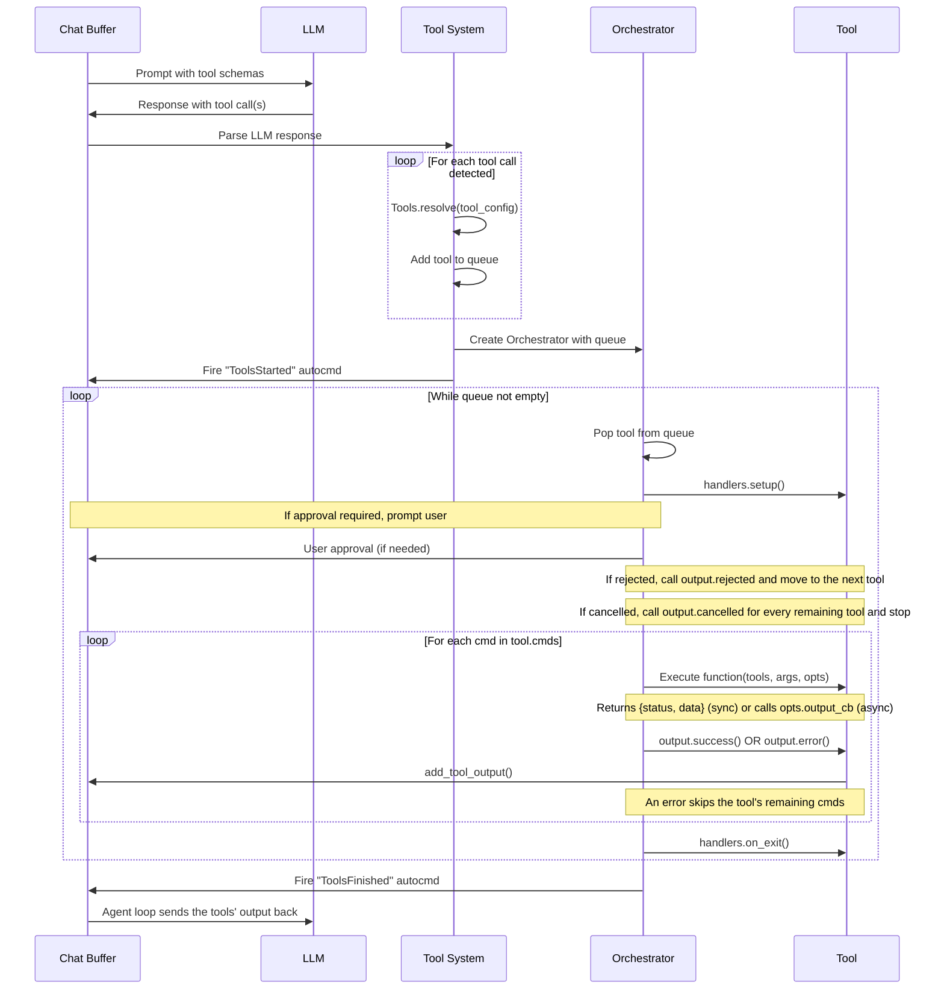

# Extending with Tools

A _tool_ lets an LLM run a function or a shell command on your machine. In CodeCompanion, a tool is a Lua table made up of an [OpenAI compatible schema](https://platform.openai.com/docs/guides/function-calling?api-mode=chat), the commands to run, and handler and output functions that manage each call. When you add a tool to the chat buffer, the LLM receives its schema and can call it. CodeCompanion then runs the tool and sends the output back to the LLM.

## Architecture

You don't need to understand the architecture to build a tool, but it shows when each of your functions is called:


```mermaid
sequenceDiagram
    participant C as Chat Buffer
    participant L as LLM
    participant TS as Tool System
    participant O as Orchestrator
    participant T as Tool

    C->>L: Prompt with tool schemas
    L->>C: Response with tool call(s)

    C->>TS: Parse LLM response

    loop For each tool call detected
        TS->>TS: Tools.resolve(tool_config)
        TS->>TS: Add tool to queue
    end

    TS->>O: Create Orchestrator with queue
    TS->>C: Fire "ToolsStarted" autocmd

    loop While queue not empty
        O->>O: Pop tool from queue
        O->>T: handlers.setup()

        Note over O,C: If approval required, prompt user
        O->>C: User approval (if needed)

        Note over O,T: If rejected, call output.rejected and move to the next tool
        Note over O,T: If cancelled, call output.cancelled for every remaining tool and stop

        loop For each cmd in tool.cmds
            O->>T: Execute function(tools, args, opts)
            Note over T,O: Returns {status, data} (sync) or calls opts.output_cb (async)
            O->>T: output.success() OR output.error()
            T->>C: add_tool_output()
            Note over O,T: An error skips the tool's remaining cmds
        end

        O->>T: handlers.on_exit()
    end

    O->>C: Fire "ToolsFinished" autocmd
    C->>L: Agent loop sends the tools' output back
```

## Building a Tool

The tools live in `lua/codecompanion/interactions/chat/tools`:

```
interactions/chat/tools
├── init.lua
├── orchestrator.lua
├── runtime/
│   ├── queue.lua
│   ├── runner.lua
├── builtin/
│   ├── cmd_tool.lua
│   ├── run_command.lua
│   ├── edit_file/
│   ├── create_file.lua
│   ├── ...
```

When the LLM calls a tool, the chat buffer passes the call to the _tool system_ in `tools/init.lua`. It resolves each tool and queues it for the _orchestrator_, which runs them one at a time.

There are two types of tool:

- **Command-based** - Run shell commands in the background with `vim.system`, so Neovim stays responsive. Suited to heavy or slow tasks
- **Function-based** - Run Lua functions in the main Neovim process, one after another, like [edit_file](https://github.com/olimorris/codecompanion.nvim/blob/main/lua/codecompanion/interactions/chat/tools/builtin/edit_file/init.lua). They can also run asynchronously

The rest of this section builds a function-based calculator that an LLM can use for basic maths.

### Structure

A tool is a table with these fields:

| Field | Type | Description |
| --- | --- | --- |
| `name` | `string` | The tool's name, matching the schema's function name and its key in the config |
| `schema` | `table` | The schema the LLM follows to call the tool |
| `cmds` | `table` | The commands or functions to run, in order |
| `system_prompt` | `string\|fun(schema)` | Extra instructions for the LLM |
| `env` | `fun(tool): table` | Values to substitute into `${}` placeholders in `cmds` |
| `handlers` | `table` | `setup`, `prompt_condition` and `on_exit` |
| `output` | `table` | `success`, `error`, `prompt`, `rejected`, `cancelled` and `cmd_string` |
| `gates` | `table` | `is_safe` and `judge_context`, for [Auto mode](/usage/chat-buffer/agents-tools#approval-modes) |
| `opts` | `table` | The tool's [options](#options), merged with `opts` from its config entry |

CodeCompanion sets two more fields when the LLM calls the tool: `args`, the decoded arguments, and `function_call`, the raw tool call.

### `cmds`

**Command-based tools**

Each command runs one after another, through the shell, using `vim.system`:

```lua
cmds = {
  { "make", "test" },
  { "echo", "hello" },
}
```

A command can be a table of arguments, a string such as `"make test"`, or a table with a `cmd` and a `flag`. A `flag` records whether the command succeeded in `chat.tool_registry.flags`, which [agentic workflows](/extending/agentic-workflows) can check. A command that exits with a non-zero code is an error, with its stderr and stdout as the output. Set `opts.timeout` in milliseconds to stop a long-running command.

To use values from the LLM's arguments in a command, return them from `env` and reference them with `${}`. The `env` function receives a copy of the tool, so `tool.args` holds the arguments:

```lua
cmds = {
  { "docker", "pull", "${lang}" },
  { "docker", "run", "--rm", "-v", "${temp_dir}:${temp_dir}", "${lang}", "${lang}", "${temp_input}" },
},
---@param tool CodeCompanion.Tools.Tool
---@return table
env = function(tool)
  local temp_input = vim.fn.tempname()
  return {
    lang = tool.args.lang,
    temp_dir = vim.fs.dirname(temp_input),
    temp_input = temp_input,
  }
end,
```

> [!TIP]
> To build commands from the LLM's arguments, insert them into `self.cmds` from `handlers.setup`, as the [run_command](https://github.com/olimorris/codecompanion.nvim/blob/main/lua/codecompanion/interactions/chat/tools/builtin/run_command.lua) tool does

**Function-based tools**

Each function receives three arguments:

- **`self`** - The tool system. The running tool is `self.tool` and the chat buffer is `self.chat`
- **`args`** - The arguments from the LLM's tool call
- **`opts`** - A table with `input`, the result of the previous function, `output_cb` for asynchronous results and `register_job` for a running `vim.SystemObj`

A synchronous function returns a table with a `status` of `"success"` or `"error"`, and its `data`. For the calculator:

```lua
cmds = {
  ---@param self CodeCompanion.Tools
  ---@param args table
  ---@param opts { input: any, output_cb: fun(result: table), register_job: fun(job: vim.SystemObj) }
  ---@return nil|{ status: "success"|"error", data: any }
  function(self, args, opts)
    local num1 = tonumber(args.num1)
    local num2 = tonumber(args.num2)
    local operation = args.operation

    if not num1 then
      return { status = "error", data = "First number is missing or invalid" }
    end

    if not num2 then
      return { status = "error", data = "Second number is missing or invalid" }
    end

    if not operation then
      return { status = "error", data = "Operation is missing" }
    end

    local result
    if operation == "add" then
      result = num1 + num2
    elseif operation == "subtract" then
      result = num1 - num2
    elseif operation == "multiply" then
      result = num1 * num2
    elseif operation == "divide" then
      if num2 == 0 then
        return { status = "error", data = "Cannot divide by zero" }
      end
      result = num1 / num2
    else
      return { status = "error", data = "Invalid operation: must be add, subtract, multiply, or divide" }
    end

    return { status = "success", data = result }
  end,
},
```

A `"success"` result calls `output.success` and moves on to the next function. An `"error"` result calls `output.error` and skips the tool's remaining functions. A function that throws a Lua error is treated in the same way.

An asynchronous function returns nothing and passes its result to `opts.output_cb` instead. Register any job with `opts.register_job` so stopping the chat can kill it:

```lua
cmds = {
  function(self, args, opts)
    local output_cb = vim.schedule_wrap(opts.output_cb)
    local job = vim.system({ "curl", "-sL", args.url }, { text = true }, function(out)
      if out.code ~= 0 then
        return output_cb({ status = "error", data = out.stderr })
      end
      output_cb({ status = "success", data = out.stdout })
    end)
    opts.register_job(job)
  end,
},
```

The `vim.system` callback runs outside the main loop, which is why `output_cb` is wrapped in `vim.schedule_wrap`. Only the first call to `output_cb` counts, and a function must either return a result or call `output_cb`, never both.

### `schema`

The schema is the structure the LLM follows to call the tool. CodeCompanion decodes the LLM's call with `vim.json.decode` and passes it to each function in [cmds](#cmds) as `args`. The calculator takes two numbers and an operation:

```lua
schema = {
  type = "function",
  ["function"] = {
    name = "calculator",
    description = "Perform simple mathematical operations on a user's machine",
    parameters = {
      type = "object",
      properties = {
        num1 = {
          type = "integer",
          description = "The first number in the calculation",
        },
        num2 = {
          type = "integer",
          description = "The second number in the calculation",
        },
        operation = {
          type = "string",
          enum = { "add", "subtract", "multiply", "divide" },
          description = "The mathematical operation to perform on the two numbers",
        },
      },
      required = {
        "num1",
        "num2",
        "operation",
      },
      additionalProperties = false,
    },
    strict = true,
  },
},
```

### `system_prompt`

The schema is usually enough for the LLM to use a tool. A complicated tool can add a system prompt, as the `memory` tool does. It's a string, or a function that receives the tool's schema.

> [!TIP]
> Use a system prompt sparingly. Needing one is often a sign that the tool should be split into several tools

To show how it works, the calculator adds one:

```lua
system_prompt = [[## Calculator Tool (`calculator`)

## CONTEXT
- You have access to a calculator tool running within CodeCompanion, in Neovim.
- You can use it to add, subtract, multiply or divide two numbers.

### OBJECTIVE
- Do a mathematical operation on two numbers when the user asks

### RESPONSE
- Always use the structure above for consistency.
]],
```

### `handlers`

Each handler receives the tool as `self` and a `meta` table with the tool system as `meta.tools`:

| Handler | Called |
| --- | --- |
| `setup` | Before approval and before anything in [cmds](#cmds). Use it to build `cmds` dynamically |
| `prompt_condition` | Before approval, when `opts.require_approval_before` isn't a boolean. Returns whether to ask the user |
| `on_exit` | After the tool's last function, after an error, or when you cancel the tool |

`edit_file` uses `prompt_condition` to read `require_approval_before = { buffer = false, file = false }` and ask only for the kind of edit you've chosen.

The calculator sends notifications so you can follow the flow:

```lua
handlers = {
  ---@param self CodeCompanion.Tools.Tool
  ---@param meta { tools: CodeCompanion.Tools }
  setup = function(self, meta)
    return vim.notify("setup function called", vim.log.levels.INFO)
  end,
  ---@param self CodeCompanion.Tools.Tool
  ---@param meta { tools: CodeCompanion.Tools }
  on_exit = function(self, meta)
    return vim.notify("on_exit function called", vim.log.levels.INFO)
  end,
},
```

> [!TIP]
> The chat buffer is `meta.tools.chat` in every handler and output function

### `output`

Output functions turn the results of [cmds](#cmds) into messages for the LLM and the user. Each receives the tool as `self`:

| Function | Signature | Called |
| --- | --- | --- |
| `success` | `(self, stdout, meta)` | After every successful function |
| `error` | `(self, stderr, meta)` | Once, when a function fails |
| `prompt` | `(self, meta)` | When approval is needed. Returns the question to ask |
| `rejected` | `(self, meta)` | When you reject the tool. `meta.opts.reason` holds your reason |
| `cancelled` | `(self, meta)` | When you cancel the tool, or it's still queued when you cancel another |
| `cmd_string` | `(self, meta)` | When labelling the tool in the chat buffer. Returns a string |

`stdout` is a list of the `data` from each of the tool's successful functions so far, and `stderr` is a list of the errors collected this turn, with the latest last. Both are `nil` when empty. `meta.tools` is the tool system.

For the calculator:

```lua
output = {
  ---@param self CodeCompanion.Tools.Tool
  ---@param stdout table
  ---@param meta { tools: CodeCompanion.Tools, cmd: table }
  success = function(self, stdout, meta)
    return meta.tools.chat:add_tool_output({ tool = self, for_llm = tostring(stdout[#stdout]) })
  end,
  ---@param self CodeCompanion.Tools.Tool
  ---@param stderr table
  ---@param meta { tools: CodeCompanion.Tools, cmd: table }
  error = function(self, stderr, meta)
    return meta.tools.chat:add_tool_output({ tool = self, for_llm = tostring(stderr[#stderr]) })
  end,
},
```

`add_tool_output` adds the tool's output to the chat's message history:

```lua
meta.tools.chat:add_tool_output({
  tool = self,
  for_llm = "The result of 6 * 7 is 42",
  for_user = "Calculated 6 * 7",
})
```

`tool` is the tool that ran, `self` in an output function. `for_llm` is sent to the LLM. `for_user` is shown in the chat buffer, `for_llm` is shown when it's `nil`, and an empty string shows nothing.

> [!IMPORTANT]
> If an output function you define doesn't call `add_tool_output`, the LLM receives a stand-in result saying the tool call didn't complete

Leave an output function out and CodeCompanion uses a default:

| Function | Default |
| --- | --- |
| `success` | `Executed` and the tool's name |
| `error` | `Error calling` and the tool's name |
| `prompt` | `Run the "calculator" tool?` |
| `rejected` | The user rejected the tool, with their reason |
| `cancelled` | The user cancelled the tool |
| `cmd_string` | The tool's name alone |

### Running the Calculator

Putting it all together:

```lua
require("codecompanion").setup({
  interactions = {
    chat = {
      tools = {
        calculator = {
          description = "Perform calculations",
          name = "calculator",
          cmds = {
            ---@param self CodeCompanion.Tools
            ---@param args table
            ---@param opts { input: any, output_cb: fun(result: table), register_job: fun(job: vim.SystemObj) }
            ---@return nil|{ status: "success"|"error", data: any }
            function(self, args, opts)
              local num1 = tonumber(args.num1)
              local num2 = tonumber(args.num2)
              local operation = args.operation

              if not num1 then
                return { status = "error", data = "First number is missing or invalid" }
              end

              if not num2 then
                return { status = "error", data = "Second number is missing or invalid" }
              end

              if not operation then
                return { status = "error", data = "Operation is missing" }
              end

              local result
              if operation == "add" then
                result = num1 + num2
              elseif operation == "subtract" then
                result = num1 - num2
              elseif operation == "multiply" then
                result = num1 * num2
              elseif operation == "divide" then
                if num2 == 0 then
                  return { status = "error", data = "Cannot divide by zero" }
                end
                result = num1 / num2
              else
                return {
                  status = "error",
                  data = "Invalid operation: must be add, subtract, multiply, or divide",
                }
              end

              return { status = "success", data = result }
            end,
          },
          system_prompt = [[## Calculator Tool (`calculator`)

## CONTEXT
- You have access to a calculator tool running within CodeCompanion, in Neovim.
- You can use it to add, subtract, multiply or divide two numbers.

### OBJECTIVE
- Do a mathematical operation on two numbers when the user asks

### RESPONSE
- Always use the structure above for consistency.
]],
          schema = {
            type = "function",
            ["function"] = {
              name = "calculator",
              description = "Perform simple mathematical operations on a user's machine",
              parameters = {
                type = "object",
                properties = {
                  num1 = {
                    type = "integer",
                    description = "The first number in the calculation",
                  },
                  num2 = {
                    type = "integer",
                    description = "The second number in the calculation",
                  },
                  operation = {
                    type = "string",
                    enum = { "add", "subtract", "multiply", "divide" },
                    description = "The mathematical operation to perform on the two numbers",
                  },
                },
                required = {
                  "num1",
                  "num2",
                  "operation",
                },
                additionalProperties = false,
              },
              strict = true,
            },
          },
          handlers = {
            ---@param self CodeCompanion.Tools.Tool
            ---@param meta { tools: CodeCompanion.Tools }
            setup = function(self, meta)
              return vim.notify("setup function called", vim.log.levels.INFO)
            end,
            ---@param self CodeCompanion.Tools.Tool
            ---@param meta { tools: CodeCompanion.Tools }
            on_exit = function(self, meta)
              return vim.notify("on_exit function called", vim.log.levels.INFO)
            end,
          },
          output = {
            ---@param self CodeCompanion.Tools.Tool
            ---@param stdout table
            ---@param meta { tools: CodeCompanion.Tools, cmd: table }
            success = function(self, stdout, meta)
              return meta.tools.chat:add_tool_output({ tool = self, for_llm = tostring(stdout[#stdout]) })
            end,
            ---@param self CodeCompanion.Tools.Tool
            ---@param stderr table
            ---@param meta { tools: CodeCompanion.Tools, cmd: table }
            error = function(self, stderr, meta)
              return meta.tools.chat:add_tool_output({ tool = self, for_llm = tostring(stderr[#stderr]) })
            end,
          },
        },
      },
    },
  },
})
```

Then, in a chat buffer:

```
Use the @{calculator} tool for 100*50
```

The chat buffer shows `5000`.

The tool can live in its own file instead. Point `path` at a Lua module or a file path that returns the tool table, or set `callback` to a function that returns it:

```lua
require("codecompanion").setup({
  interactions = {
    chat = {
      tools = {
        calculator = {
          description = "Perform calculations",
          path = "user.tools.calculator",
        },
      },
    },
  },
})
```

## Approvals


An LLM can call a tool in ways you didn't expect. To have CodeCompanion ask you before a tool runs, set `require_approval_before` in the tool's `opts`:

```lua
require("codecompanion").setup({
  interactions = {
    chat = {
      tools = {
        calculator = {
          description = "Perform calculations",
          path = "user.tools.calculator",
          opts = {
            require_approval_before = true,
          },
        },
      },
    },
  },
})
```

`require_approval_before` can also be a function that receives the tool and the tool system, and returns a boolean. For any other value, such as a table, `handlers.prompt_condition` decides.

Add `output.prompt` to word the question:

```lua
output = {
  ---@param self CodeCompanion.Tools.Tool
  ---@param meta { tools: CodeCompanion.Tools }
  ---@return string
  prompt = function(self, meta)
    return string.format("Perform the calculation `%s %s %s`?", self.args.num1, self.args.operation, self.args.num2)
  end,
},
```

This asks `Perform the calculation 100 multiply 50?`, and you can always accept, accept, reject or cancel. Rejecting asks for an optional reason, which is sent to the LLM, and moves on to the next tool. Cancelling stops every remaining tool.

To change what the LLM is told in either case:

```lua
output = {
  ---@param self CodeCompanion.Tools.Tool
  ---@param meta { tools: CodeCompanion.Tools, cmd: table, opts: { reason?: string } }
  ---@return nil
  rejected = function(self, meta)
    meta.tools.chat:add_tool_output({ tool = self, for_llm = "The user declined to run the calculator tool" })
  end,

  ---@param self CodeCompanion.Tools.Tool
  ---@param meta { tools: CodeCompanion.Tools, cmd: table }
  ---@return nil
  cancelled = function(self, meta)
    meta.tools.chat:add_tool_output({ tool = self, for_llm = "The user cancelled the execution of the calculator tool" })
  end,
},
```

### Auto Mode

In [Auto mode](/usage/chat-buffer/agents-tools#approval-modes), tools run without asking. A tool with `protect` or `require_cmd_approval` set in its config entry still goes through approval, where two `gates` can let it run without asking:

| Gate | Description |
| --- | --- |
| `is_safe(self, meta)` | Returns `true` to run the tool without asking, as `run_command` does for its `safe_commands` |
| `judge_context(self, meta)` | Returns a plain English description of the call for the [LLM judge](/configuration/tools#llm-judge) to vet |

`protect` turns both gates off, so the tool always asks. The judge only runs when it's enabled and the tool sets `opts.judge = true`. `require_cmd_approval` makes **Always accept** apply to a single command, as returned by `output.cmd_string`, rather than the whole tool.

## Extending `cmd_tool`

Most custom tools run a command on your machine, and the handlers and output functions in [run_command](/usage/chat-buffer/agents-tools#run-command) already cover that. Set `extends = "cmd_tool"` to reuse them, and provide:

| Field | Description |
| --- | --- |
| `name` | The tool's name, matching its key in the config |
| `description` | What the tool does, sent to the LLM in the schema |
| `schema` | The schema's `properties` and `required`, with `additionalProperties` optional |
| `build_cmd` | A function that receives the LLM's arguments and returns the command to run, as a string |
| `system_prompt` | Optional instructions for the LLM |

`cmd_tool` wraps `schema` in a full schema, runs the command from `build_cmd` and shows it in the approval prompt. Your own `handlers` and `output` functions replace the matching defaults, and `gates` are passed through. `cmd_tool` doesn't carry over `opts` from the tool table, so set them on the config entry.

This wraps the [beads](https://github.com/steveyegge/beads) CLI:

```lua
require("codecompanion").setup({
  interactions = {
    chat = {
      tools = {
        ["beads"] = {
          extends = "cmd_tool",
          description = "Beads task management",
          opts = { require_approval_before = true },
          name = "beads",
          system_prompt = [[Beads is a local, hash-based task tracking system. Tasks have short IDs like `bd-a1b2`. Key commands:

- `bd ready` - list tasks with no open blockers (i.e. ready to work on)
- `bd show <id>` - show full details for a task
- `bd create "<title>" -p <priority>` - create a new task (priority 0 = highest)
- `bd update <id> --claim` - assign a task to yourself
- `bd update <id> --status done` - mark a task as done
- `bd dep add <child> <parent>` - make child depend on parent

Output is JSON. Always use `bd ready` first to see what's available before taking action.]],
          schema = {
            properties = {
              action = {
                type = "string",
                enum = { "ready", "show", "create", "update", "dep" },
                description = "The beads action to perform",
              },
              task_id = {
                type = "string",
                description = "The task ID (e.g. bd-a1b2). Required for show, update, and dep actions",
              },
              args = {
                type = "string",
                description = "Additional arguments for the command (e.g. title for create, flags for update)",
              },
            },
            required = { "action" },
          },
          build_cmd = function(args)
            local parts = { "bd", args.action }
            if args.task_id then
              table.insert(parts, args.task_id)
            end
            if args.args then
              table.insert(parts, args.args)
            end
            return table.concat(parts, " ")
          end,
        },
      },
    },
  },
})
```

To keep the tool in its own file, point `path` at it in your config:

```lua
require("codecompanion").setup({
  interactions = {
    chat = {
      tools = {
        ["beads"] = {
          description = "Beads task management",
          opts = { require_approval_before = true },
          path = "~/.dotfiles/.config/tools/beads.lua",
        },
      },
    },
  },
})
```

Then return the tool from that file:

```lua
-- ~/.dotfiles/.config/tools/beads.lua
return {
  extends = "cmd_tool",
  name = "beads",
  description = "Manage tasks using the Beads task tracking system (bd CLI)",
  system_prompt = [[...]],
  schema = { ... },
  build_cmd = function(args)
    local parts = { "bd", args.action }
    if args.task_id then
      table.insert(parts, args.task_id)
    end
    if args.args then
      table.insert(parts, args.args)
    end
    return table.concat(parts, " ")
  end,
}
```

The `schema` limits what the LLM can pass to `build_cmd`, and the `system_prompt` tells it what each beads command does so it can choose the right action.

## Adapter Tools

Some providers, such as [Anthropic](https://docs.claude.com/en/docs/agents-and-tools/tool-use/computer-use-tool) and [OpenAI](https://platform.openai.com/docs/guides/tools-web-search?api-mode=responses), run their own tools that CodeCompanion can enable. PR [#2307](https://github.com/olimorris/codecompanion.nvim/pull/2307) added them to the Anthropic and OpenAI adapters. To support one in an adapter:

1. Add the tool to the adapter's `available_tools`:

```lua
-- openai.lua
available_tools = {
  ["web_search"] = {
    description = "Allow models to search the web for the latest information before generating a response.",
    enabled = true,
    ---@param self CodeCompanion.HTTPAdapter
    ---@param meta { tools: table }
    callback = function(self, meta)
      table.insert(meta.tools, {
        type = "web_search",
      })
    end,
  },
},
```

The `callback` can also change the adapter for the tool to work. Anthropic's tools add a beta header, for example. An entry can also set a `system_prompt`, and `enabled` can be a function that receives the adapter.

2. In the adapter's `handlers.request.build_tools`, call the `callback` for any adapter tool:

```lua
build_tools = function(self, args)
  local tools = args.tools
  local transformed = {}
  for _, tool in pairs(tools) do
    for _, schema in pairs(tool) do
      if schema._meta and schema._meta.adapter_tool then
        if self.available_tools[schema.name] then
          self.available_tools[schema.name].callback(self, { tools = transformed })
        end
      else
        -- Transform the schema as normal
      end
    end
  end
  return { tools = transformed }
end,
```

Some adapter tools are _hybrid_, with a client-side part that CodeCompanion runs, like Anthropic's [memory](/usage/chat-buffer/agents-tools#memory) tool. Set `opts.client_tool` to the path of the built-in tool's entry in the config:

```lua
["memory"] = {
  -- ...
  opts = {
    client_tool = "interactions.chat.tools.memory",
  },
},
```

## Options

Options go in the tool's `opts`, or in `opts` on its config entry, which takes precedence:

| Option | Description |
| --- | --- |
| `require_approval_before` | Ask before the tool runs. A boolean, a function or a value for `handlers.prompt_condition` |
| `require_cmd_approval` | Make **Always accept** apply to one command at a time. Config entry only |
| `protect` | Always ask in Auto mode. Config entry only |
| `judge` | Let the LLM judge vet the tool in Auto mode |
| `timeout` | Stop a command-based tool's commands after this many milliseconds |
| `use_handlers_once` | Run `setup` and `on_exit` once when the LLM calls the tool several times in a row. Calls after the first skip approval |

`use_handlers_once` is for a tool the LLM often calls several times in one response, such as an editor:

```lua
return {
  name = "editor",
  opts = {
    use_handlers_once = true,
  },
  -- ...
}
```

## Limitations

- Tools only work with HTTP adapters. ACP adapters bring their own tools
- Function-based tools run in the main Neovim process, so a slow synchronous function blocks the editor until it returns
