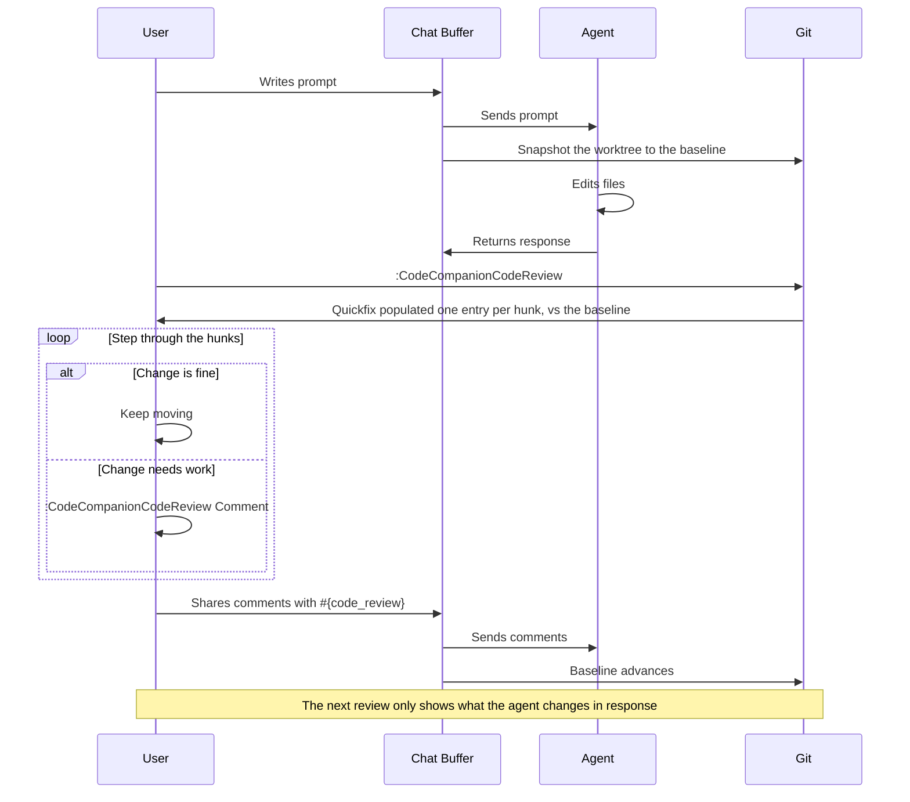

# Using Code Reviews

Code reviewing an agents work usually involves the manual typing of the file name along with the line number and your comment. For example, _"in `foo.lua`, around line 42, this should be..."_. Code reviews let you leave comments exactly where the code is. You can put your cursor on a line, or, make a visual selection, and then add a comment. Then, when you send your review to an agent, each comment arrives with the full context.

Sending a review also **advances a baseline**, which turns agent iterations into rounds. Your next review only shows what the agent changed in response, not the full edit history. In essence, it's the same loop as a pull request: comment, submit, re-review the response.

Code reviews work with CodeCompanion's own tools, ACP agents, and even CLI agents like Claude Code running outside of Neovim.

## How It Works



When an agent begins working in a git repository, CodeCompanion snapshots the worktree to a _baseline_ (a commit at `refs/worktree/codecompanion/baseline`). When you start a review, the diff between that baseline and the repo's files is produced. As the baseline lives in git and the review comments are persisted to disk, your progress is stored across sessions and Neovim instances.

Because the diff is recomputed from disk every time, line numbers are never stored and so can never rot.

> [!IMPORTANT]
> Snapshots are produced against an index of CodeCompanion's own, kept at `.git/codecompanion-index`, so `git add` never runs against yours. This means your staged changes and anything you push are unaffected by a code review

## Commands

| Command | Description |
| --- | --- |
| `:CodeCompanionCodeReview` | Open the agent's changes in the quickfix list, one entry per hunk |
| `:CodeCompanionCodeReview Accept` | Accept the current hunk, keeping it out of future reviews |
| `:CodeCompanionCodeReview All` | As above, but include every change since the baseline - accepted hunks and files beyond the agent's |
| `:CodeCompanionCodeReview Approve` | Approve everything up to now, advancing the baseline |
| `:CodeCompanionCodeReview Comment` | Comment on the current line or visual selection, or edit the comment already there |
| `:CodeCompanionCodeReview Comments` | Open the pending comments file for editing |
| `:CodeCompanionCodeReview Ignore` | Ignore the current hunk's file until the baseline advances |
| `:CodeCompanionCodeReview Share` | Submit the review to a file and copy its path - for agents outside CodeCompanion |
| `:CodeCompanionCodeReview Start` | The same as `Approve` - use it before an agent starts, to mark the point you'll review from |

## Keymaps

CodeCompanion sets keymaps in the quickfix window when you start a review.

| Keymap | Description |
| --- | --- |
| `a` | Accept the hunk under the cursor |
| `c` | Comment on the hunk under the cursor |
| `d` | Diff the hunk under the cursor  |
| `x` | Ignore the hunk's file until the baseline advances |

Of course, you still have the default Vim keymaps in the quickfix such as `[q` / `]q` to step through the hunks, and `:copen` / `:cclose` to open and close the quickfix window.


## Commenting

Adding a comment is as simple as putting your cursor on a line, or, making a visual selection, and:

```
:CodeCompanionCodeReview Comment
```

You can then type your comment in the input, followed by the same keymaps you use to send a message in the chat buffer (`<CR>` in normal mode for example). Your comments are stored against the file, the line range and the code on those lines.

A comment is only ever in one place: **pending in the file, or sent in the chat buffer**. When you share a review, the virtual text clears and the comments appear in the chat buffer instead.

### Editing and Deleting

To change a comment, you can run `:CodeCompanionCodeReview Comment` when your cursor is back on the line. **Submitting the input empty deletes the comment**.

To review/edit all comments at once, `:CodeCompanionCodeReview Comments` opens the raw comments file. `:bw` saves your edits.

### Sending

Use the [code_review](/usage/chat-buffer/editor-context#code-review) editor context in a chat buffer:

```md
Please action #{code_review}
```

This will be expanded to _"Please action my comments from the code review, which I've attached"_. The LLM receives each comment as a block containing the path, the line range, the code you commented on, and your prose. In the chat buffer, a shorter, readable version is also added so you can see what was sent without opening the [debug window](/usage/chat-buffer/#debug-window).

If you have no pending comments there's nothing to send, and `#{code_review}` does nothing. A review you're happy with can end with `:CodeCompanionCodeReview Approve`, to advance the baseline and treat any new changes as a new round.

## Reviewing Hunks

If an agent has made _many_ changes, you can step through them one hunk at a time with:

```
:CodeCompanionCodeReview
```

Every change since the baseline goes into the quickfix list (`:h quickfix`), one entry per hunk. From there:

1. Step through the hunks with Vim's own keymaps, `:cnext` or `]q`
2. Press `d` on a hunk to see it as a diff against the baseline
3. Press `c` to comment on it
4. Press `a` to accept it, dropping it from this review and future ones
5. Press `x` to ignore the hunk's whole file, for lockfiles and generated code

Accepted hunks and ignored files remain until the baseline advances.

To reject a hunk outright, diff it with `d` and use Vim's native `do` (`:h do`) to pull the baseline's version back in, then write the file. The revert drops out of the next review by itself.

### Scoping

By default a review only covers the files an agent edited **through CodeCompanion's tools**. Append `All` to widen it to every change since the baseline:

```
:CodeCompanionCodeReview All
```

That includes your own edits, edits from outside of Neovim, hunks you've accepted and files you've ignored.

## Diffing

CodeCompanion owns the **baseline and the comments** but doesn't own the diff view. `refs/worktree/codecompanion/baseline` is a normal git ref, so any diff plugin can be pointed at it.

With [diffview.nvim](https://github.com/sindrets/diffview.nvim):

```
:DiffviewOpen refs/worktree/codecompanion/baseline
```

With [gitsigns.nvim](https://github.com/lewis6991/gitsigns.nvim):

```
:Gitsigns change_base refs/worktree/codecompanion/baseline
```

This enables you to move between an agent's changes as you see fit and still use `CodeCompanionCodeReview Comment` to leave feedback.

> [!WARNING]
> Ensure you comment from the **working file**, not from the baseline side of a diff

## Parallel Agents

If you run multiple agents at at time, it's common to have each in its own [git worktree](https://git-scm.com/docs/git-worktree) within the repository and Code Reviews have been built to support that.

The baseline ref lives under `refs/worktree/`, which git scopes per-worktree in the same way it scopes `HEAD`. Comments are stored per repository root and per branch so each agent gets its own baseline and its own pending comments. This ensures reviews never clash. To switch to a worktree, run `:CodeCompanionCodeReview` to review only that agent's work.

## Working in the CLI

Depending on your workflow, you may like to use a coding agent outside of Neovim. If that's the case, you can still leverage the code review functionality.

The baseline sees every change in your worktree, no matter who made it - so you can review an agent that CodeCompanion didn't start, such as Claude Code running in a separate terminal:

1. `:CodeCompanionCodeReview Start` before the agent begins
2. Let the agent work
3. `:CodeCompanionCodeReview All` to review everything since the baseline
4. Leave comments with `:CodeCompanionCodeReview Comment`, as normal
5. `:CodeCompanionCodeReview Share` to begin sharing with the agent. Your comments move to a `review.md` file, the baseline advances, and the file's path is copied to your clipboard
6. Paste the path into the agent:

```
Please action my code review: /path/to/review.md
```

`All` is required because CodeCompanion can only attribute a change to an agent when it goes through CodeCompanion's own tools or interactions.

> [!TIP]
> The `review.md` path is static at a repository level. Therefore, in a `CLAUDE.md` or `AGENTS.md` file you can reference this file, only needing to do `:CodeCompanionCodeReview Share` to advance the baseline.

If the agent runs in CodeCompanion's own [CLI interaction](/usage/cli), steps 1-4 are the same, but you can submit with `#{code_review}` directly in the prompt instead of `Share`.

## Without Git

Without git there's no baseline, so `:CodeCompanionCodeReview` falls back to a file-level view. The files the agent has edited in the session, are tracked by `:CodeCompanionChat Changes`. Comments and `#{code_review}` work as normal.

## Limitations

When you make comments, they are stored and hard-coded to line numbers. Therefore, if you make substantial edits between submitting the comments, those line numbers can deviate. However, because the comments are attached to a code snippet, it should still be enough context for the agent.

`Approve` doesn't discard comments, it simply advances the baseline and warns you that they're still pending. So a review you meant to send isn't silently thrown away. Use `:CodeCompanionCodeReview Comments` to delete them manually.

<style scoped>
table td:first-child code {
  white-space: nowrap;
}
</style>
