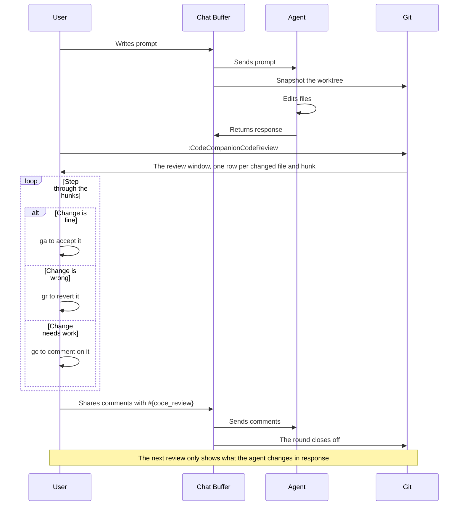

# Using Code Reviews

> [!IMPORTANT]
> Code reviews are still in **beta**. As such, the workflow below is subject to change.

Code reviewing an agent's work typically involves you searching the code base for their changes, reading the code and writing your comments back into the chat or CLI, maybe copying relevant code snippets as you go. Broadly speaking, this works. Although, it is a slow and tedious process.

In CodeCompanion, `:CodeCompanionCodeReview` opens a review window: the agent's changed files and their hunks on the left, the whole file with the changes highlighted on the right. You step through the hunks, accept the ones you're happy with, revert the ones you're not, and comment on anything you want the agent to address. When you wish to send your review to an agent, go to the chat or CLI and use `#{code_review}` in the prompt.

Sending a review via the chat or CLI **closes the round off**. This effectively accepts all of the agent's edits until it starts another round of editing. The next review only shows what the agent changed in response, not the full edit history. In essence, it's the same loop as a pull request: comment, submit, re-review the response.

Code reviews work with CodeCompanion's own tools, ACP agents, and even CLI agents like Claude Code running outside of Neovim.

## How It Works



When an agent begins working in a git repository, CodeCompanion snapshots the worktree (a commit at `refs/worktree/codecompanion/baseline`). When you start a review, the diff between that snapshot and the repo's files is produced. As the snapshot lives in git and the review comments are persisted to disk, your progress is stored across sessions and Neovim instances.

That snapshot is taken on the first prompt in any editing round. If you prompt again before reviewing the code then it stays at the exact same point it was at, prior. The result of this is that you never lose sight of what's been edited by an agent as the edits accumulate.

You never have to set or advance it yourself. A round closes off when you send your comments, when you share them, or when you've cleared every hunk out of the review window.

> [!IMPORTANT]
> Snapshots are produced against an index owned by CodeCompanion, so `git add` never runs against the user's index. This means a user's staged changes and anything that's pushed are unaffected by a code review

## Commands

| Command | Description |
| --- | --- |
| `:CodeCompanionCodeReview` | Open the review window |
| `:CodeCompanionCodeReview Branch` | Review every change on the branch since it left the default branch |
| `:CodeCompanionCodeReview Comment` | Comment on the current line or visual selection, or edit the comment already there |

Everything else is a keymap inside the window.

## The Review Window

The window opens in its own tab page with two panels:

- The **checklist** on the left is every changed file with its hunks nested underneath. Moving the cursor onto a hunk scrolls the file alongside it. A file row shows the lines still to review in it and, when the file is open in a buffer, its error and warning counts. The first row is the size of the round: `3 files, 12 hunks in 5 rows, 1 with errors, 2 auto-accepted`
- The **review pane** on the right is the whole file, not just the hunk, so you can judge a change against the code around it. The gutter shows the line number in the working file, and any comments you've left appear above the lines they were written on.

Both are ordinary splits, so `<C-w>` and your own window keymaps work as they always do.

| Keymap | Description |
| --- | --- |
| `ga` | Accept the hunk under the cursor, or every hunk in the file when you're on a file row |
| `gr` | Revert the hunk under the cursor, putting the file back as it was |
| `gc` | Comment on the line under the cursor |
| `gC` | Edit the pending comments by hand |
| `gs` | Share the review with an agent outside of CodeCompanion |
| `u` | Undo the last accept or revert |
| `i` / `I` | Open the real file at this line, to edit it yourself |
| `]h` / `[h` | Move to the next or previous row in this file |
| `?` | List these keymaps |

Accepting a hunk folds it into the snapshot, so it reads as ordinary context rather than as an edit. Reverting writes the original lines back to the file. Either way the hunk stops being a difference and leaves the list, and a file disappears once its last hunk has gone. The review is a to-do list of things to clear, not a record of what you did.

`ga` and `gr` act on what is literally under the cursor. Between hunks in the review pane they do nothing. On a file row, `ga` accepts the whole file at once, which saves clearing a lockfile or a generated file a hunk at a time.

Files are listed with the ones most likely to need you first: files with errors, then the files with the most changed lines in the round. The order is fixed for the round, so accepting a hunk never moves the file you're in. Files you never want to see, such as lockfiles, can be [auto-accepted](/configuration/code-review#auto-accepting-files).

Neighbouring hunks are grouped into one row, so a rename that touches a function in six places is one row to accept, revert or step to with `]h`. Hunks inside the same function, method or class are grouped, using Neovim's Tree-sitter parser for the file's language, and the row is named for it: `+6 -6  in build_diff`, or `+24 -0  new build_diff` when the whole function arrived in this round. Hunks outside any scope, or in a language with no parser, are grouped when six or fewer unchanged lines separate them, which is the same gap a plain `git diff` folds into one hunk.

When the last hunk goes, the window says `No edits left to review` and the round is closed off as soon as you leave it.

> [!NOTE]
> The review pane is not writable. Its rows don't map cleanly onto the file - a deleted line doesn't exist on disk - so `i` and `I` take you to the real file at the matching line instead, with your LSP and formatting intact

## Reviewing a Branch

To review everything a branch has changed, not just the agent's last round:

```
:CodeCompanionCodeReview Branch
```

The review starts from where the branch left the default branch (`origin/HEAD`, or `main` when there's no remote) and includes your uncommitted work. Hunks you had already accepted come back, and pending comments are kept. Once you've cleared the last row, reviews go back to following the agent's rounds.

## Commenting

Comments can be left from the review pane with `gc`, or from any buffer by putting your cursor on a line, or making a visual selection, and:

```
:CodeCompanionCodeReview Comment
```

You can then type your comment in the input, followed by the same keymaps you use to send a message in the chat buffer (`<CR>` in normal mode for example). Your comments are stored against the file, the line range and the code on those lines.

A comment doesn't settle a hunk. You can accept a change and still comment on it, and a reverted hunk still sends its comment so the agent knows why.

A comment is only ever in one place: **pending in the file, or sent in the chat buffer**. When you share a review, the virtual text clears and the comments appear in the chat buffer instead.

Your comments come back in the next review. A row whose lines you commented on last round ends in `↳`, and the review pane shows what you asked above the change, so you read the agent's response against the request rather than from memory. The match is by line, give or take a few, so a response that landed far from the comment isn't marked.

### Editing and Deleting

To change a comment, put your cursor back on the line and use `gc` in the review pane, or `:CodeCompanionCodeReview Comment` in an ordinary buffer. The input opens with what you wrote, and **submitting it empty deletes the comment**.

To review or edit all comments at once, `gC` in the review window opens the raw comments file. `:bw` saves your edits.

### Sending

Use the [code_review](/usage/chat-buffer/editor-context#code-review) editor context in a chat buffer:

```md
Please action #{code_review}
```

This will be expanded to _"Please action my comments from the code review, which I've attached"_. The LLM receives each comment as a block containing the path, the line range, the code you commented on, and your prose. In the chat buffer, a shorter, readable version is also added so you can see what was sent without opening the [debug window](/usage/chat-buffer/#debug-window).

If you have no pending comments there's nothing to send, and `#{code_review}` does nothing.

## Scoping

A review covers **every change since the snapshot**, whoever made it and however it was made. An agent that edits with a shell command, or hands the work to a sub-agent, is reviewed the same as one using CodeCompanion's own tools.

## Bringing Your Own Diff

CodeCompanion owns the **snapshot and the comments**. `refs/worktree/codecompanion/baseline` is a normal git ref, so any diff plugin can be pointed at it if you'd rather read the changes elsewhere.

With [diffview.nvim](https://github.com/sindrets/diffview.nvim):

```
:DiffviewOpen refs/worktree/codecompanion/baseline
```

With [gitsigns.nvim](https://github.com/lewis6991/gitsigns.nvim):

```
:Gitsigns change_base refs/worktree/codecompanion/baseline
```

You can still use `:CodeCompanionCodeReview Comment` to leave feedback from there.

> [!WARNING]
> Ensure you comment from the **working file**, not from the baseline side of a diff

## Parallel Agents

If you run multiple agents at at time, it's common to have each in its own [git worktree](https://git-scm.com/docs/git-worktree) within the repository and Code Reviews have been built to support that.

The ref lives under `refs/worktree/`, which git scopes per-worktree in the same way it scopes `HEAD`. Comments are stored per repository root and per branch so each agent gets its own snapshot and its own pending comments. This ensures reviews never clash. To switch to a worktree, run `:CodeCompanionCodeReview` to review only that agent's work.

## Working in the CLI

Depending on your workflow, you may like to use a coding agent outside of Neovim. If that's the case, you can still leverage the code review functionality.

The snapshot sees every change in your worktree, no matter who made it - so you can review an agent that CodeCompanion didn't start, such as Claude Code running in a separate terminal:

1. Let the agent work
2. `:CodeCompanionCodeReview` to review everything it changed
3. Leave comments with `gc`, as normal
4. `gs` to begin sharing with the agent. Your comments move to a `review.md` file, the round closes off, and the file's path is copied to your clipboard
5. Paste the path into the agent:

```
Please action my code review: /path/to/review.md
```

> [!TIP]
> The `review.md` path is static at a repository level. Therefore, in a `CLAUDE.md` or `AGENTS.md` file you can reference this file, only needing to do `gs` to share a new round of comments.

If the agent runs in CodeCompanion's own [CLI interaction](/usage/cli), you can submit with `#{code_review}` directly in the prompt instead of `gs`.

## Without Git

Without git there's no snapshot to diff against, so there's nothing to review. The files an agent has edited in the session are still tracked by `:CodeCompanionChat Changes`, and comments and `#{code_review}` work as normal.

## Limitations

When you make comments, they are stored and hard-coded to line numbers. Therefore, if you make substantial edits between submitting the comments, those line numbers can deviate. However, because the comments are attached to a code snippet, it should still be enough context for the agent.

Clearing the review doesn't discard comments. A review you meant to send isn't silently thrown away - use `gC` to delete them by hand.

<style scoped>
table td:first-child code {
  white-space: nowrap;
}
</style>
