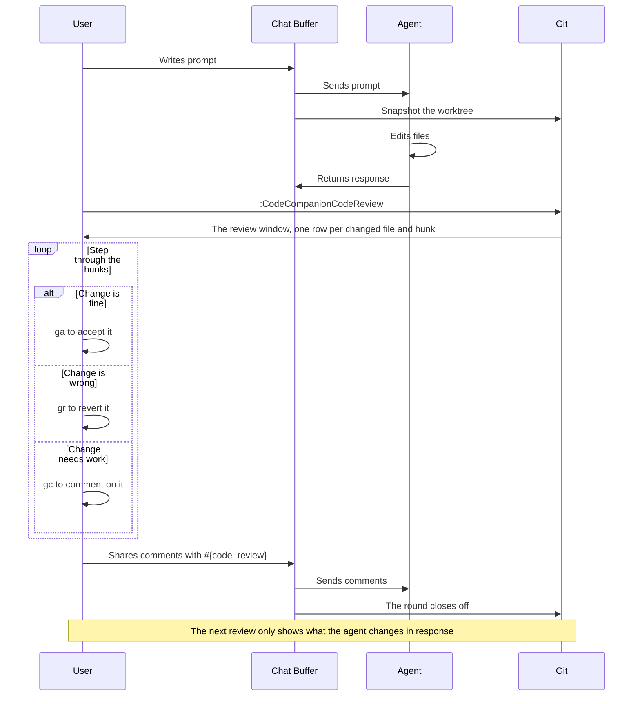

# Using Code Reviews

> [!IMPORTANT]
> Code reviews are in **beta**, so the workflow below may change


Reviewing an agent's work usually means hunting through the codebase for its changes, then copying snippets and comments back into the chat. _Code reviews_ let you step through an agent's changes, accept or revert them, and comment on anything you want it to address - a pull request review, in Neovim.

You don't need the review window to leave a comment. Flag a line from **any buffer** as you read your code, and it's sent to the agent with the rest of your review.

Code reviews work with CodeCompanion's own tools, ACP agents and CLI agents like Claude Code running outside of Neovim.

## How It Works


```mermaid
sequenceDiagram
    participant U as User
    participant C as Chat Buffer
    participant A as Agent
    participant G as Git

    U->>C: Writes prompt
    C->>A: Sends prompt
    C->>G: Snapshot the worktree
    A->>A: Edits files
    A->>C: Returns response

    U->>G: :CodeCompanionCodeReview
    G->>U: The review window, one row per changed file and hunk

    loop Step through the hunks
        alt Change is fine
            U->>U: ga to accept it
        else Change is wrong
            U->>U: gr to revert it
        else Change needs work
            U->>U: gc to comment on it
        end
    end

    U->>C: Shares comments with #35;{code_review}
    C->>A: Sends comments
    C->>G: The round closes off

    Note over U,G: The next review only shows what the agent changes in response
```

On the first prompt of a round, CodeCompanion snapshots the worktree to `refs/worktree/codecompanion/baseline`. A review is the diff between that snapshot and your files, so it covers every change, however it was made. Prompting again before you review leaves the snapshot where it is, so edits accumulate rather than disappear.

A round closes off when you send or share your comments, or clear every hunk from the review window. The next review only shows what changed after that.

> [!IMPORTANT]
> Snapshots use an index owned by CodeCompanion, so your staged changes are never touched

## Commands

| Command | Description |
| --- | --- |
| `:CodeCompanionCodeReview` | Open the review window |
| `:CodeCompanionCodeReview Branch` | Review every change on the branch since it left the default branch |
| `:CodeCompanionCodeReview Comment` | Comment on the current line or visual selection, or edit the comment already there |

## The Review Window

The review window opens in its own tab. The **checklist** on the left lists each changed file and its hunks, and the **review pane** on the right shows the whole file with the changes highlighted.

| Keymap | Description |
| --- | --- |
| `ga` | Accept the hunk under the cursor, or every hunk in the file when you're on a file row |
| `gr` | Revert the hunk under the cursor, putting the file back as it was |
| `gc` | Comment on the line under the cursor |
| `gC` | Edit the pending comments by hand |
| `gs` | Share the review with an agent outside of CodeCompanion |
| `u` | Undo the last accept or revert |
| `i` / `I` | Open the real file at this line, to edit it yourself |
| `]h` / `[h` | Move to the next or previous row in this file |
| `?` | List these keymaps |

Accepted and reverted hunks leave the list, and a file disappears with its last hunk. Files with errors are listed first, then the files with the most changes. Lockfiles and other files you never want to see can be [auto-accepted](/configuration/code-review#auto-accepting-files).

Neighbouring hunks are grouped into one row. Hunks in the same function are grouped using Tree-sitter, and the row is named for it: `+6 -6  in build_diff`, or `new build_diff` when the whole function is new. A row with a single change shows the changed line.

> [!NOTE]
> The review pane isn't writable. Use `i` or `I` to edit the real file at the matching line

## Reviewing a Branch

To review everything the current branch has changed, including uncommitted work:

```
:CodeCompanionCodeReview Branch
```

A round only shows what the agent changed since your last review. A branch review shows the whole branch in one pass, such as before you open a pull request, including anything changed before a snapshot was taken.

Pending comments are kept. Once you've cleared the last row, reviews go back to following the agent's rounds.

## Commenting

<p align="center">
<video controls muted title="Adding code review comments" src="https://github.com/user-attachments/assets/c4a1f997-6d94-4b37-a3ee-9dd553d5ee3c"></video>
</p>

Comments can be left from **anywhere** in Neovim. Put your cursor on a line, or make a visual selection, in any buffer:

```
:CodeCompanionCodeReview Comment
```

In the review window, `gc` does the same. Submit with the same keymaps as the chat buffer, and the comment shows as virtual text wherever the file is open. Comments are stored against the file, the lines and the code on them. A comment doesn't settle a hunk, so you can accept a change and still comment on it.

In the next review, a row you commented on ends in `↳` and the review pane shows what you asked above the change.

### Editing and Deleting

Use `gc` or `:CodeCompanionCodeReview Comment` on the same line to edit a comment. **Submitting it empty deletes it**. `gC` opens every pending comment in one file.

### Sending

Use the [code_review](/usage/chat-buffer/editor-context#code-review) editor context in a chat buffer:

```md
Please action #{code_review}
```

The LLM receives each comment with its path, lines and code. A shorter version is added to the chat buffer so you can see what was sent.

## Working in the CLI

Agents that CodeCompanion didn't start, such as Claude Code in a separate terminal, can be reviewed too:

1. Let the agent work
2. `:CodeCompanionCodeReview` and leave comments with `gc`
3. `gs` to move your comments to a `review.md` file and copy its path
4. Paste the path into the agent:

```
Please action my code review: /path/to/review.md
```

> [!TIP]
> The `review.md` path never changes for a repository, so you can reference it in a `CLAUDE.md` or `AGENTS.md` file

If the agent runs in CodeCompanion's [CLI interaction](/usage/cli), use `#{code_review}` in the prompt instead.

## Bringing Your Own Diff

`refs/worktree/codecompanion/baseline` is a normal git ref, so any diff plugin can read it:

```
:DiffviewOpen refs/worktree/codecompanion/baseline
:Gitsigns change_base refs/worktree/codecompanion/baseline
```

> [!WARNING]
> Comment from the **working file**, not the baseline side of a diff

## Parallel Agents

Each [git worktree](https://git-scm.com/docs/git-worktree) gets its own snapshot and comments, so agents in separate worktrees never share a review.

## Without Git

Without git there's nothing to review against. `:CodeCompanionChat Changes` still lists the files an agent edited, and comments work as normal.

## Limitations

- Comments are stored against line numbers, which drift if the file changes a lot before you send them. The code snippet sent with each comment usually gives the agent enough context
- Closing a round doesn't discard pending comments. Use `gC` to delete them

<style scoped>
table td:first-child code {
  white-space: nowrap;
}
</style>
