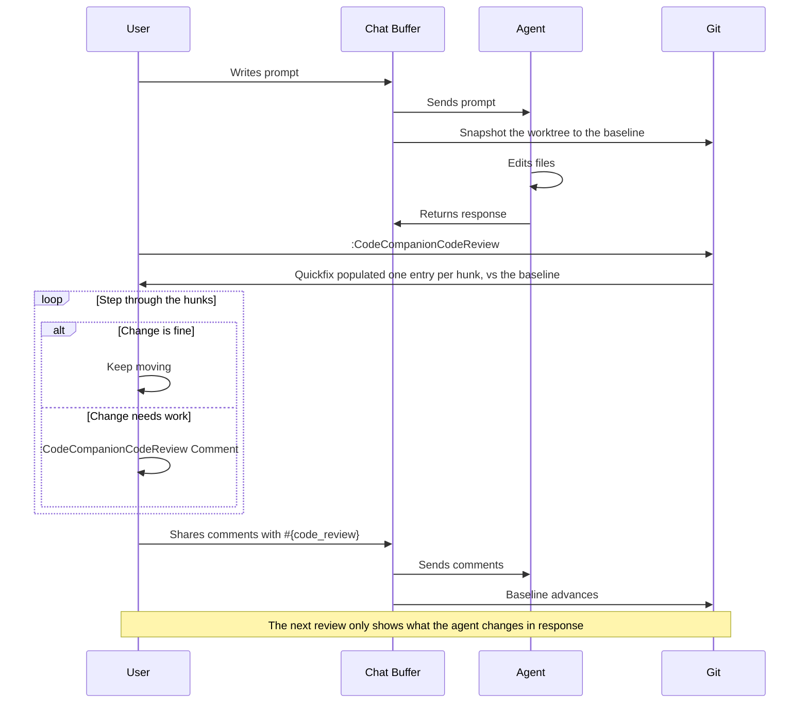

# Using Code Reviews

A common friction point for senior developers working with agents is how can they adequately review their changes. To that end, CodeCompanion lets you review an agent's edits the way you'd review a [pull request](https://docs.github.com/en/pull-requests/reference/pull-request-reviews) on GitHub. You can step through every change, leave comments in place and submit them back to the agent to address. It works with CodeCompanion's own tools, ACP agents, and even CLI agents like Claude Code running outside of Neovim.

## How It Works



When an agent begins working in a git repository, CodeCompanion snapshots the worktree to a _baseline_ (a commit at `refs/worktree/codecompanion/baseline`). When you start a review, the diff between that baseline and the repo's files is produced. As the baseline lives in git and the review comments are persisted to disk, your progress is stored across sessions and Neovim instances.

Reviews are scoped to where you are: each branch keeps its own baseline and pending comments, and the baseline ref is per-worktree (the same mechanism git uses for `HEAD`), so agents running in separate [git worktrees](https://git-scm.com/docs/git-worktree) of the same repository never share a review.

Submitting a review advances the baseline, so the next review only shows what the agent changed in response. Exactly like new commits on a pull request.

## Workflow

CodeCompanion's code review workflow has been loosely designed around GitHub's  [pull request review](https://docs.github.com/en/pull-requests/reference/pull-request-reviews). The full workflow is:

1. Ask an agent to make changes, via the [chat](/usage/chat-buffer/index), the [CLI](/usage/cli) interaction or in outside of Neovim
2. `:CodeCompanionCodeReview` sends every change to the quickfix list (`:h quickfix`), one entry per hunk, with line numbers. Use `All` to widen the list to every change since the baseline - your own edits and previously accepted hunks included
3. Step through the changes with `:cnext` or `]q`
4. Use `:CodeCompanionCodeReview Comment` to leave feedback on a line or a visual selection
5. Use `:CodeCompanionCodeReview Accept` to drop the hunk from the list and keep it out of future reviews, or `Ignore` to drop the file's hunks altogether - useful for lockfiles and generated code
6. You can send your comments to the agent by using the [#{code_review}](/usage/chat-buffer/editor-context#code_review) editor context, or approve all the agent's changes with `:CodeCompanionCodeReview Approve`, which advances the baseline:

```
Please action #{code_review}
```

Sharing your comments with `#{code_review}` resets the comments and advances the baseline, so the next review only shows what the agent changed in response. If you stepped through and had nothing to say, there's nothing for `#{code_review}` to send - end a clean review with `:CodeCompanionCodeReview Approve` instead.

7. If you need to edit any comments you've made, you can do so with `:CodeCompanionCodeReview Comments`
8. If you're working with an agent outside of Neovim, you can use `:CodeCompanionCodeReview Share` to submit your comments to a file and copy its path to your clipboard. The agent can then read the file and respond to your feedback


## Commands

| Command | Description |
| --- | --- |
| `:CodeCompanionCodeReview` | Open the agent's changes in the quickfix list, one entry per hunk |
| `:CodeCompanionCodeReview Accept` | Accept the current hunk, keeping it out of future reviews |
| `:CodeCompanionCodeReview All` | As above, but include every change since the baseline - accepted hunks and files beyond the agent's |
| `:CodeCompanionCodeReview Approve` | Approve everything up to now, without comments |
| `:CodeCompanionCodeReview Comment` | Leave a comment on the current line or visual selection |
| `:CodeCompanionCodeReview Comments` | Open the pending comments file for editing |
| `:CodeCompanionCodeReview Ignore` | Ignore the current hunk's file until the baseline advances |
| `:CodeCompanionCodeReview Share` | Submit the review to a file and copy its path - for agents outside CodeCompanion |
| `:CodeCompanionCodeReview Start` | The same as `Approve` - use it before an agent starts, to mark the point you'll review from |

## Keymaps

CodeCompanion sets keymaps in the quickfix window when you start a review.


| Keymap | Description |
| --- | --- |
| `a` | Accept the hunk under the cursor |
| `c` | Comment on the hunk under the cursor |
| `x` | Ignore the hunk's file until the baseline advances |


## Editing Review Comments

Prior to sending your review, you can edit your comments in place with `:CodeCompanionCodeReview Comments`. To retract a comment, delete its section; to amend one, edit the prose. The file is the source of truth, so anything you change there is what gets submitted.

## Working in the CLI

Depending on your workflow, you may like to use a coding agent outside of Neovim, in the terminal. If that's the case, you can still leverage the code review functionality.

The baseline sees every change in your worktree, no matter who made it - so you can review an agent that CodeCompanion didn't start, such as Claude Code running in a separate terminal:

1. `:CodeCompanionCodeReview Start` before the agent begins
2. Let the agent work
3. `:CodeCompanionCodeReview All` to review everything since the baseline
4. Leave comments with `:CodeCompanionCodeReview Comment`, as normal
5. `:CodeCompanionCodeReview Share` to begin sharing with the agent. Your comments move to a `review.md` file, the baseline advances, and the file's path is copied to your clipboard
6. Paste the path into the agent:

```
Please action my code review: /path/to/review.md
```

The `All` scope is needed because CodeCompanion can only attribute changes to an agent when they go through its own tools. With an external agent, you're telling CodeCompanion "everything since the baseline is the agent's work".

> [!TIP]
> The review file's path is static, at a repository level. Therefore, in a `CLAUDE.md` or `AGENTS.md` file you can reference this file, only needing to do `:CodeCompanionCodeReview Share` to advance the baseline.

If the agent runs in CodeCompanion's own [CLI interaction](/usage/cli), steps 1-4 are the same, but you can submit with `#{code_review}` directly in the prompt instead of `Share`.

## Using `gitsigns` or `diffview`

Because the baseline is a real git ref, plugins that render diffs can point to it. With [gitsigns.nvim](https://github.com/lewis6991/gitsigns.nvim):

```vim
:Gitsigns change_base refs/worktree/codecompanion/baseline true
```

The sign column now marks exactly the agent's changes, and `]c` / `[c` steps through them with inline previews. With [diffview.nvim](https://github.com/sindrets/diffview.nvim), a full side-by-side review:

```vim
:DiffviewOpen refs/worktree/codecompanion/baseline
```

The ref name is stable, and always follows the baseline for the branch you're on.

## Without Git

Without git there's no baseline, so `:CodeCompanionCodeReview` falls back to a file-level view. The files the agent has edited in the session, are tracked by `:CodeCompanionChat Changes`. Comments and `#{code_review}` work as normal.

<style scoped>
table td:first-child code {
  white-space: nowrap;
}
</style>

